# Basics of HTML, CSS & JS  
## HTML & CSS
### Chapter 2: Text  
* we use **tags** or (*markups*) to structure our web pages and to give them meanings for thier contents
* we have two types of markups:
    1. **Structural markup**: the elements that you can use to describe both headings and paragraphs
    2. **Semantic markup**: which provides extra information; such as where emphasis is placed in a sentence, that something you have written is a quotation (and who said it), the meaning of acronyms, and so on  
#### Headings  
* we have 6 levels of headings in **HTML**, they go from *larger* to *smaller*  
* we use `<h1>` ,`<h2>`, `<h3>` etc. tags to create a headings  
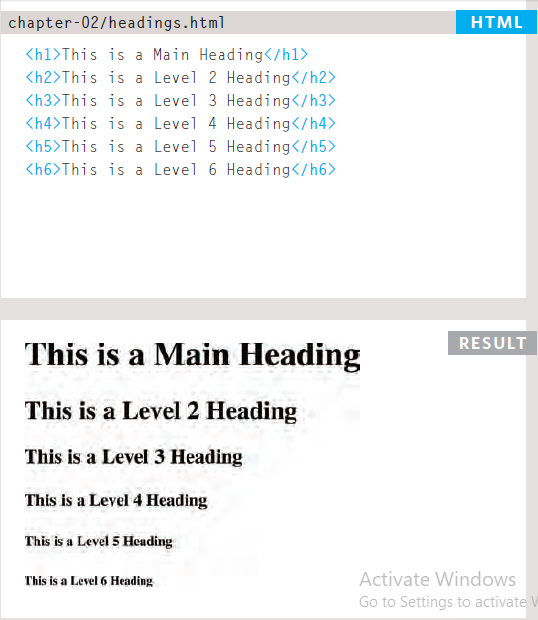  

#### Paragraphs  
* **paragraphs** are block elements used to create a content related to a certain topic or heading
* to create a **paragraph** we use `

` tag .  
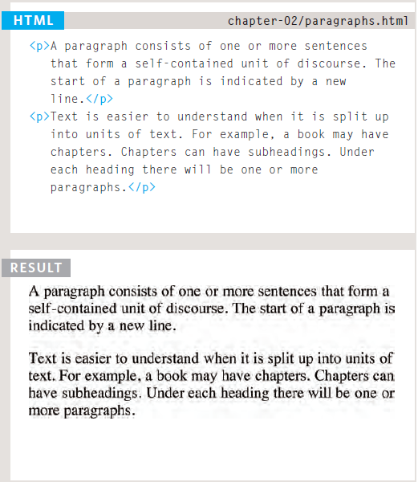  

#### Bold & Italic  
* we use `<b></b>` tag to create a **bold** text
* we use `<i></i>` tag to create an *italic* text  
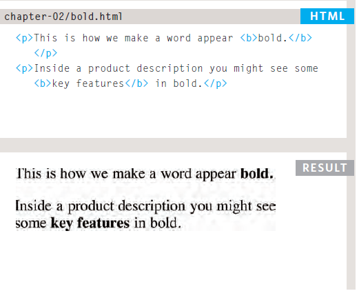 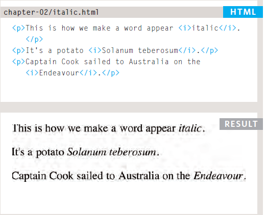  

#### Superscript & Subscript  
* we use `` tag to **superscript** a text
* we use `` tag to **subscript** a text  
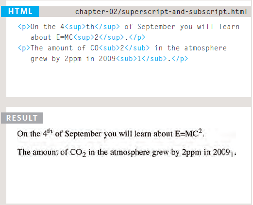  

#### White Space
* **HTML** only recognize single space within texts. further than one space, then it will ignore it.  
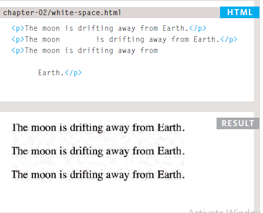  

#### Line Breaks & Horizontal Rules  
* we create **line breaks** using `  or  `
* we create a **horizontal rules** using `
 or 
`  
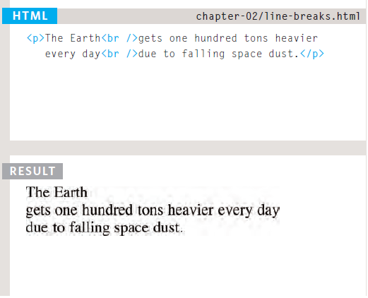 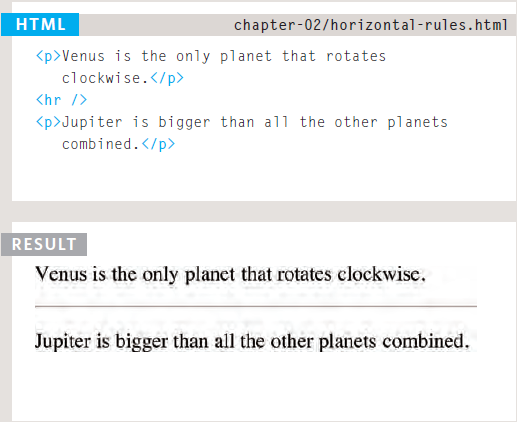  

#### Semantic Markup  
* to show that a text has a **strong importance** we use the `<strong></strong>` tag
* to show that text must be **emphasize** we use the `<em><em>` tag
* to create **Quotations** we use two tage  
    1. `<blockquote>` tag : The `<blockquote>` element is used for longer quotes that take up an entire paragraph.
    2. `<q>` tag : The `<q>` element is used for shorter quotes that sit within a paragraph.  
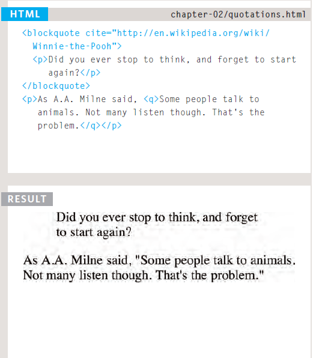  
* If we use an abbreviation or an acronym, then the `<abbr>` element can be used. A title attribute on the opening tag is used to specify the full term.
* we these tags also for:  
    * `<cite>` to indicate where the citation is from.
    * `<dfn>` to indicate the defining instance of a new term.
    * `<address>` to contain contact details for the author of the page.
    * `<ins>` and `<del>`: The `<ins>` element can be used to show content that has been inserted into a document, while the `<del>` element can show text
    * `<s>` to indicates something that is no longer accurate or relevant (but that should not be deleted). that has been deleted from it.
    
### Chapter 10: Introducing CSS  
* **CSS** is used to style web pages.
* **CSS** has defferent rule sets than **HTML**
* **CSS** treats each HTML element as if it appears inside its own box and uses rules to indicate how that element should look.  
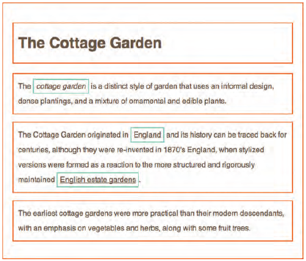  

* Rules are made up of **selectors** (that specify the elements the rule applies to) and declarations (that indicate what these elements should look like).  
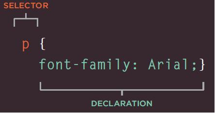  

* Different types of selectors allow you to target your rules at different elements.  
* Declarations are made up of two parts: the properties of the element that you want to change, and the values of those properties. For example, the font-family property sets the choice of font, and the value arial specifies Arial as the preferred typeface.  
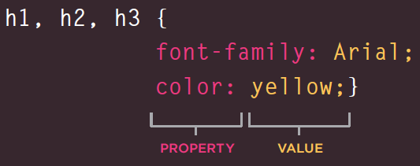  

* **CSS** rules usually appear in a separate document, although they may appear within an HTML page.  
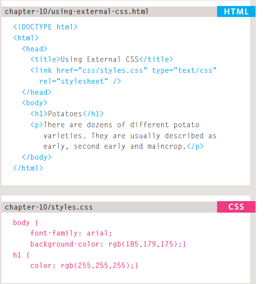   

## JavaScript  
### Chapter 2: Basic JavaScript Instructions  
* A script is made up of a series of statements. Each statement is like a step in a recipe.
* Scripts contain very precise instructions. For example, you might specify that a value must be remembered before creating a calculation using that value.  
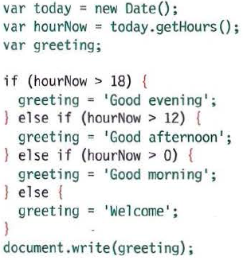  
* to create comments we use `//` sign for a single comment, or `/* */` for multiple comments
* **Variables** are used to temporarily store pieces of information used in the script.  
  
* we have *three data types* in **Javascropt**:
    1. **numbers**: any number ex(12151 , 154.00055, 0.0045, -4855)
    2. **strings**: letters and texts. we asign a **string** by using either `""` or `''` signs.
    3. **booleans**: **booleans** have twovalues, either **true** ot **false**  
* there are rule for naming a variable.  
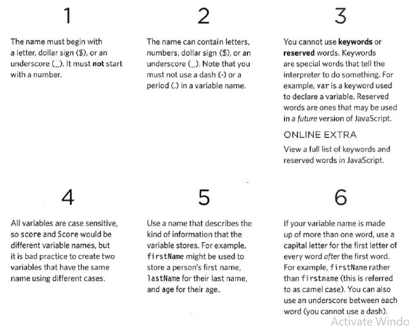
* **Arrays** are special types of variables that store more than one piece of related information.  
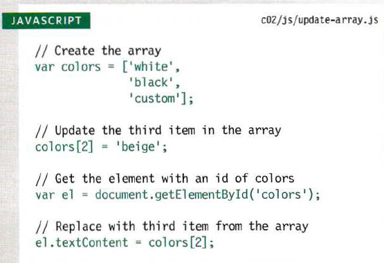  
* JavaScript distinguishes between **numbers** (0-9), **strings** (text), and **Boolean** values (true or false).  

* Expressions evaluate into a single value.  

* Expressions rely on operators to calculate a value. 
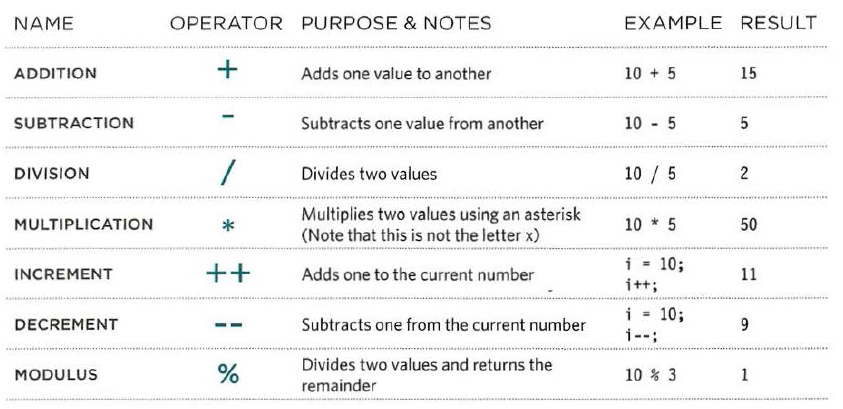  

### Chapter 4: Decisions and Loops  
* **Conditional statements** allow your code to make decisions about what to do next.  
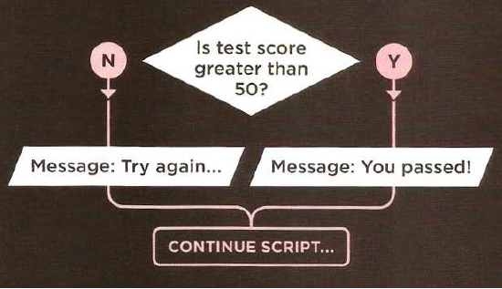  
  
* **Comparison operators** (===, ! ==, ==, ! =, <, >, <=, =>) are used to compare two operands.  
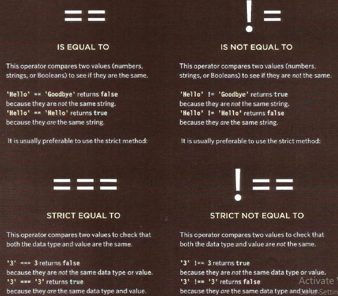  
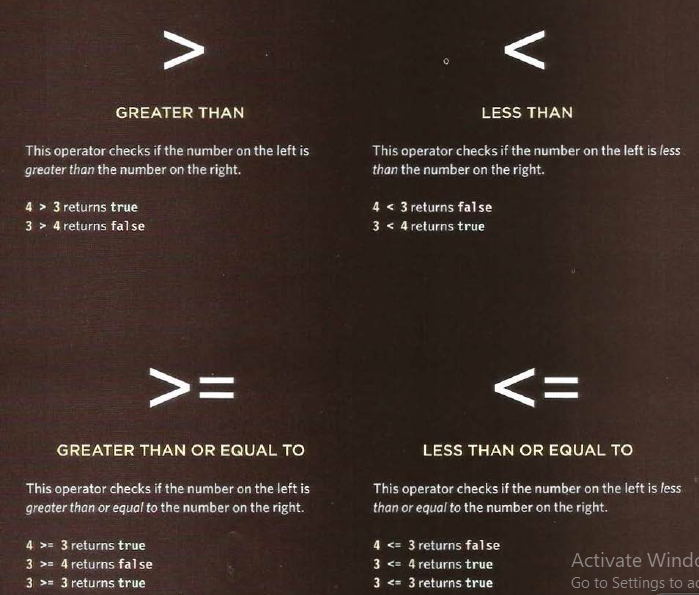   
* **Logical operators** allow you to combine more than one set of comparison operators.  
  
* **if ... else** statements allow you to run one set of code, if a condition is true, and another if it is false.  
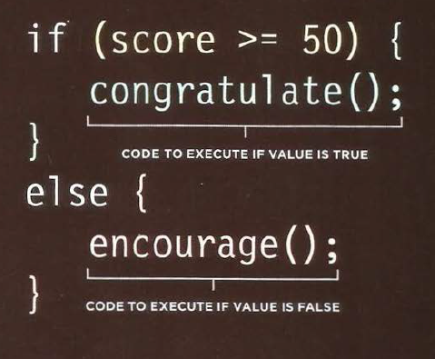  
* switch statements allow you to compare a value against possible outcomes (and also provides a default
option if none match).