# HTML Lists, Control Flow with JS, and the CSS Box Model  
## Lists
* we have three types of *lists*:
    1. Ordered lists
    2. Unordered lists
    3. Definition lists
### Ordered lists
* The **ordered list** is created with the `<ol>` element.
* Each item in the list is placed between an opening `<li>` tag and a closing `</li>` tag. (The **li** stands for list item.)
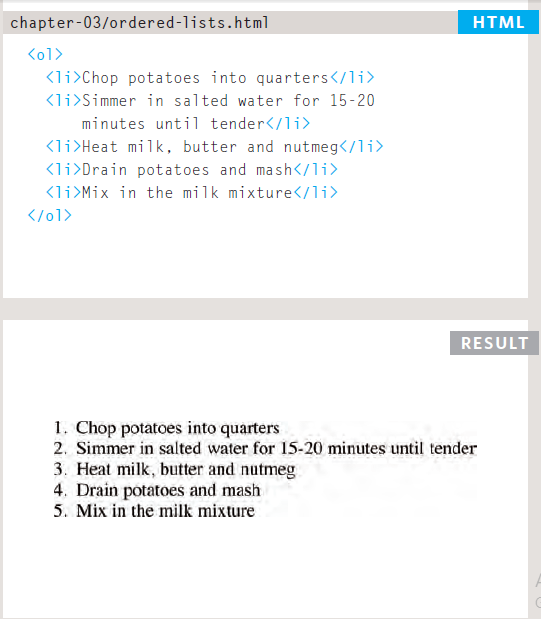  
  
### Unordered lists
* The unordered list is created with the `<ul>` element.
* Each item in the list is placed between an opening `<li>` tag and a closing `</li>` tag.
  
  
### Definition Lists  
* The definition list is created 
with the `<dl>` element and usually
consists of a series of terms and
their definitions.
* Inside the `<dl>` element you will
usually see pairs of `<dt>` and
`<dd>` elements.
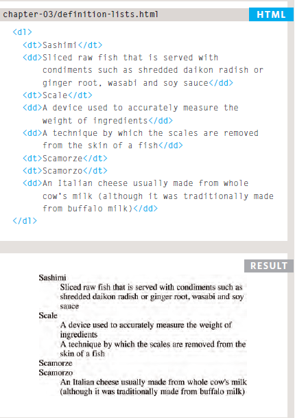  
* we can nest lists of different types inside each other
  
## Boxes
* many elements in **HTML** are rendered inside boxes (ex: `
`,`<H>`,`
`,`<li>` etc.), and through **CSS** we can control the appearance of these boxes and so thier position.
  
### Dimensions
* the primary dimensions are **height** and **width**. Also, we can put limit on thier maximum and minimum value through **min-width, max-width** + **min-height, max-height** properties.  
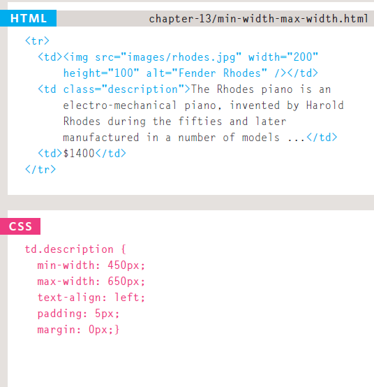  
* we can also, comtrol if a certain part of our content is bigger than its container by either hiding it or scrolling it. this is achieved by the **overflow** property and its two value of: 
    1. **hidden**
    1. **scroll**  
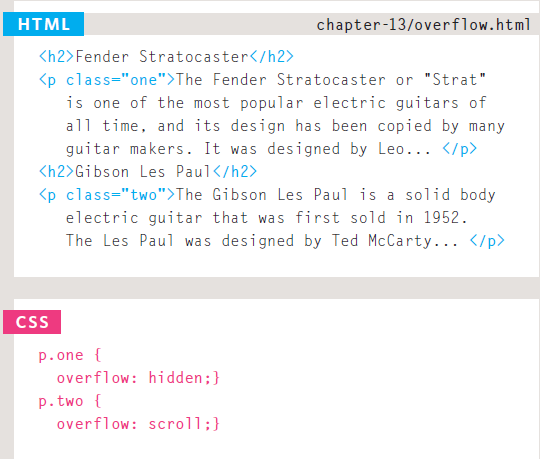
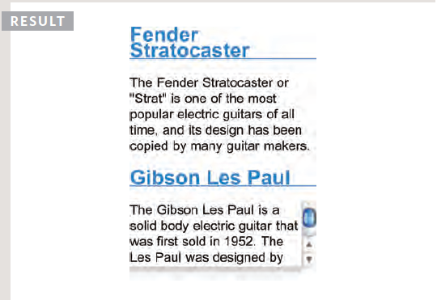  
  
### Border, Margin & Padding
* Every box has three available properties that can be adjusted to control its appearance:  
    1. **Border**
    1. **Margin**
    1. **Padding** 
* **Border** is an invisible feature of any box. it's at default set at (0). The border
separates the edge of one box
from another.
* **Margin** sit outside the edge
of the border. You can set the
width of a margin to create a
gap between the borders of two
adjacent boxes.
* **Padding** is the space between the border of a box and any content contained within it. Adding padding can increase the readability of its contents.  
  
* we can control the **border** im many ways, like its _color_, _backgroung-color_ and specially its **_width_**  
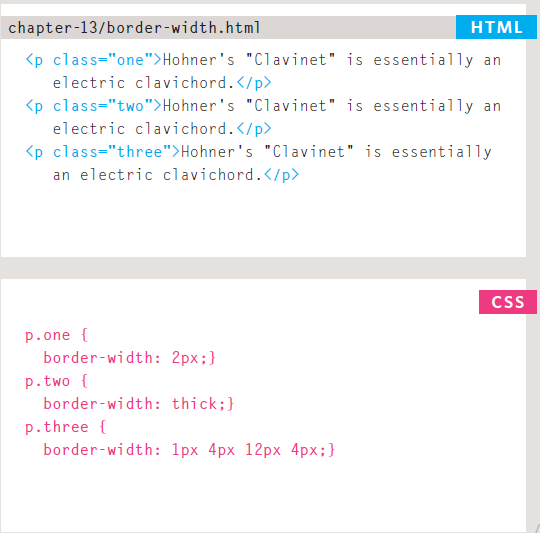
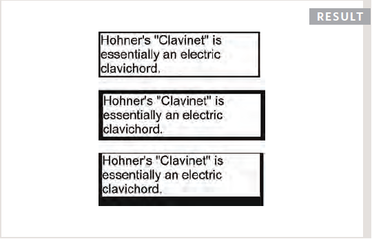  
* Also, we can style our **border** with many properties lik:
    * solid
    * dotted
    * dashed
    * double
    * groove
    * ridge
    * inset
    * outset
    * hidden / none  
* we can control the border color. either same color or each side a color.
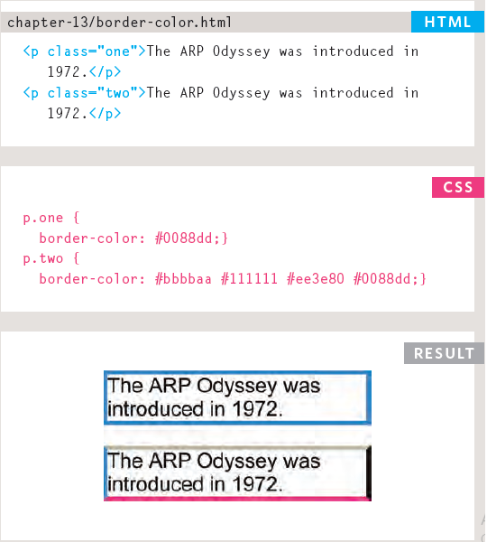  
* we can also shorthand all the previous properties in one line.
* All three features can be controled in any and all direction as prefered.
* setting the **margin** to auto will center the box in the middel of the page

### Change Inline/Block
* using the **diplay** property allow us to control how some elements are presented(**block or inline**)
* the **display**nproperty has four *values*:
    1. inline
    1. block
    1. inline-block
    1. none
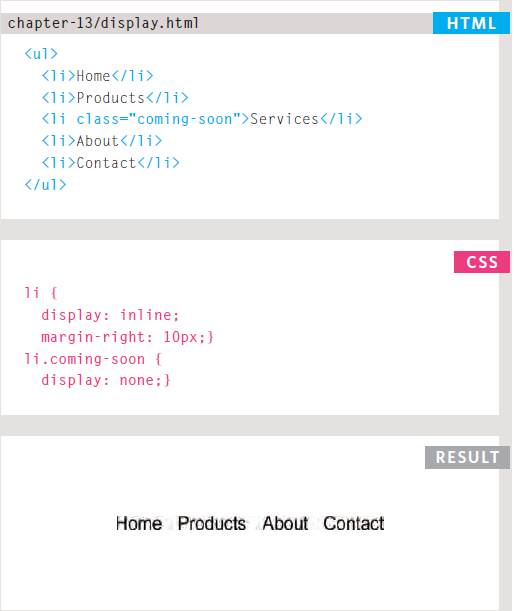  
  
### Hiding Boxes
* The **visibility** property allows
us to hide boxes from users
but It leaves a space where the
element would have been.  
* this property has two value:
    1. hidden
    1. visible
  
* e can also make and image a border with **border-image** property, create shadows by **box-shadow** property, make the corners round by **border-radius** property, or even make the whole border a circle bt **border-radius** property.

## ARRAYS
* **Arrays** are special type of data (Objects), that can store mutiple values and has theoretically limits.
* creating an **array** is no different than any variable in **JS**, either by using **var**, **let** or **const**.
* each value in an **array** is separated with a comma.
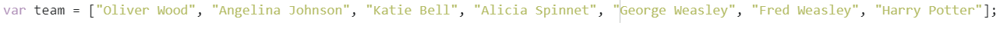  
* each item on a list has **position**, the first position always starts with **[0]**
* we can access and modify any **array** item individually by naming its position and declaring it a value.
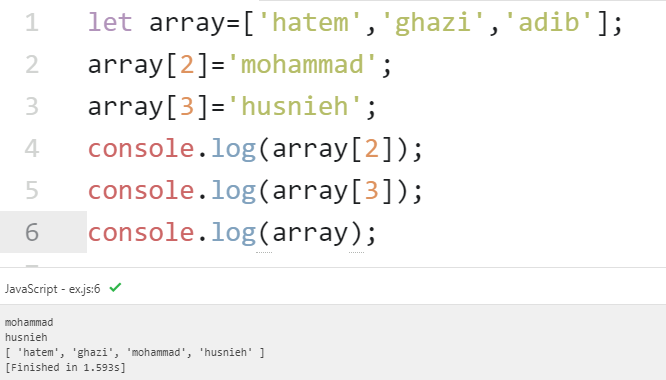  
  
## If...Else Statement
* **if...else** statement check a condition, if it evaluates to **true**, then a code of block weill run. if it evaluates to **false**, then another code of block will run.
* we can nest more than one **if...else** statements inside each others  
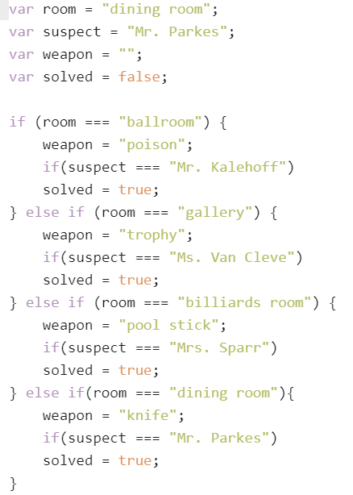  

## SWITCH Statements
* **switch** statements are a **faster** method for applying a code when a certain value is valid
* **switch** statements has something called **switch value**, this value is what the browser serch for.
* each value is listed with a **case** statement followed by a block of code.
* when a value is met if there is no **break** statement then the code block after it will run too
* we can asign a **default** code block to run whenever no values meet the **switch value**
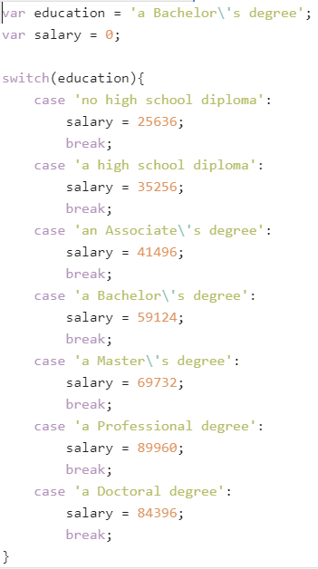  

## TYPE COERCION & WEAK TYPING
**Javascript** transform data types if there is an error in it, which cause some to say it is a weak language

## TRUTHY & FALSY VALUES
Due to type coercion, every value in JavaScript
can be treated as if it were true or false; and
this has some interesting side effects.  

## CHECKING EQUALITY & EXISTENCE 
evrey value in value in **JS** is considered a **boolean**. by this many object or arrays are used as a condition operand
  
## Loops  
* **loops** check a condition, if it is true, then a code will run a number of time. if it is fale then it will not run and stop.
* we have tree types of **loops**:
    1. **for loops**
    1. **while loops**
    1. **do...while loops**
* **for loop** is best fitted when we want to eun a code for known number of times, and the rest types of loops are for wehn we do not know how many times we want to run the code. Ofcourse we can determine how many time the **while** and **do...while** loops will run.
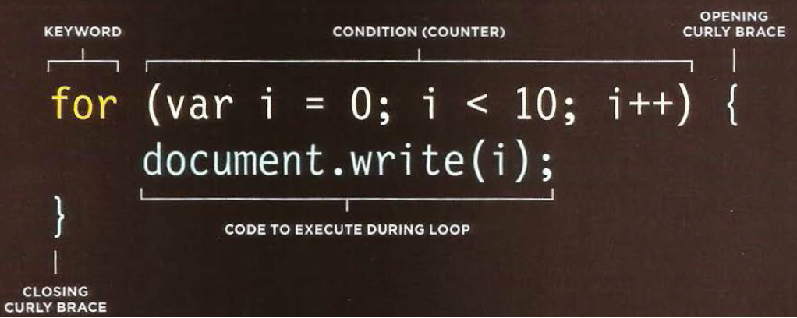  
* the mpst common use of **loops** is to loop over **arrrays**
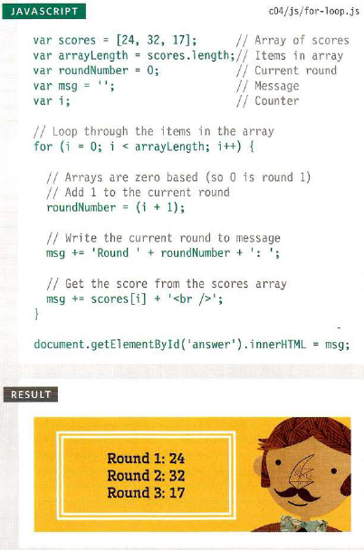  

