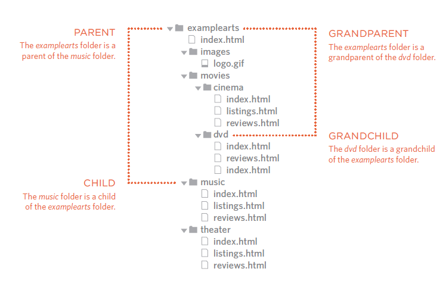
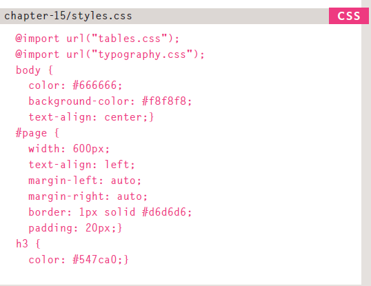
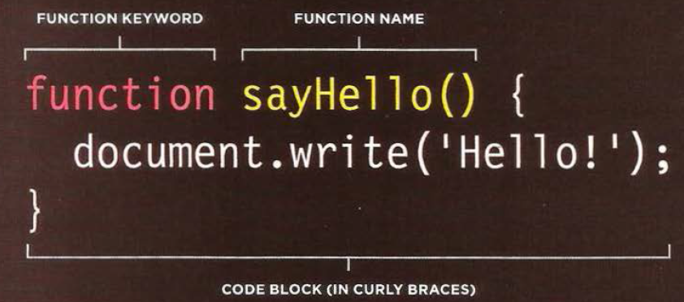
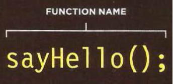
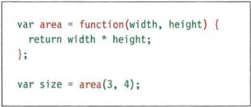

# HTML Links, JS Functions, and Intro to CSS Layout
## Links
* links are made by the `<a>` tag.
  
* when linking to a page on the same side you'll use relative **url**  
* when your web site is large, it is better to put each page on a different file.
  
* **relative URL**s are easier to use, and you don't need to tell the browser what the domain is. only the file or how it is related to the file you are linking to. for example (`./` current diretory),(`../` parent directory),(`folder1/file.ext` child directory) etc.
* you can start the user eamil application by using `mailto` value inside the `href` attribute
  
* to oopen a **link** in a **new window** use the attribute `target="_blank"`
  
* by giving and **id** for part of your site, you can link to them.
  

## Layout
* each element in **HTML** is treated as a box, either an **block-level box** or an **inline box**
* elements that contains other lements are called **parent elements**
* **CSS** allows you to control the position of all elements in your site
* the default positioning in browsers is called **normal flow**, where each element sits over the following element
* through `position:relative` you can move an element in relation to its normal flow position,where you determine the top,right,left,bottom positions.
* through `position:absolute` you make an element **static** so all elements will ignore its position and might overlap with it.
* you can make an element position fixed no matter the user scroll and with no overlapping with other lements through `position:fixed` 
* when elements overlap, you can deside what element apear in front through `z-index`
* you can make an element flow to any edge or side on the user screen through `float`, and all other elements will flow aroung that element when trying to overlap it. also, you should define the **dimensions** of the element you wanna make float.
* you can make elements float beside each other through defining thier **width** and giving them `float` property.
* through `clear` property you can prevent elements from touching the box of a certain element. this property can take the following values:(_left,right,both,none_)
* you can create **Columns** through using `
` element as a container, and then applying properties like **float**, **margin**,etc.
* **Resolution** refers to the number of dots a screen shows per inch
* poeple use different screens to view your site.
* you can use **percentages**, **pixeles** or other measuring units but **pixeles** and **percentages** are preffered
* * using **percentages** as a unit will make your elements viewed in a liquid way.
* you can separate your style sheet by using `@import` to import style shhets within a style sheet. or you can link many style sheets through using `<link>` tag
  
  
## Funcrions, Method and Objects
* **function** is a qroup of code statements that are reusable, that runs togather. **functions** can return values or return nothing(consoling something for example)
* some **functions** take parameters to work
* **functions** have names
  
* **functions** must be called to be utilized
  
* there are two methods to create functions:
    1. FUNCTION DECLARATION
    1. FUNCTION EXPRESSION
  
* **functions expressions** are needed when a function is going to be called once
* we two type of scopes for variables:
    1. local variables
    1. global variables
* **local** **variable** are created inside functions, and can only be useded where they where created, or in children functions
* **global** **variables** are created outside functions, and can be used everywhere
* errors will happen if two **global variable** names are the same. however, if a **local variable** and a **global variable** have the same name, then no errors occur
  
## 6 Reasons for Pair Programming
* **pair** **programming** is the practice of two developers sharing a single workstation to interactively tackle a coding task together
* **pair** **programming** commonly involves two roles: the **Driver** and the **Navigator**.
* the **Driver** write the code, while the **navigator** guids him
* in **pair** **programming** developers explain out loud what the code should do, listen to others’ guidance, read code that others have written, and write code themselves.
* there are six benefits of pair programming, which are:
    1. Greater efficiency
    2. Engaged collaboration
    3. Learning from fellow students
    4. Social skills
    5. Job interview readiness
    6. Work environment readiness
