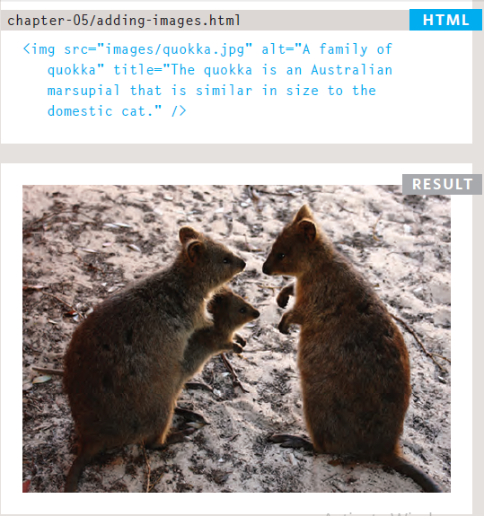
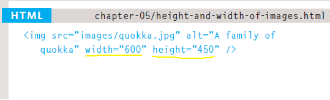
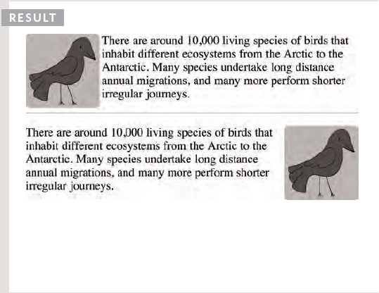
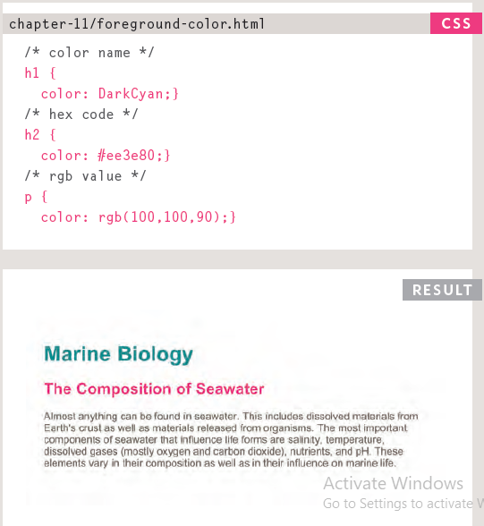
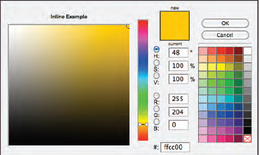
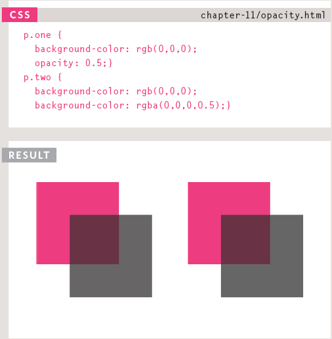
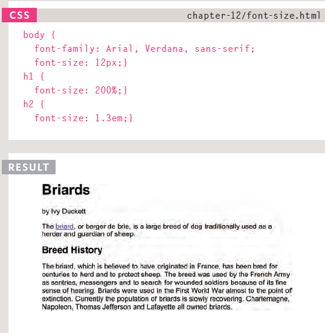
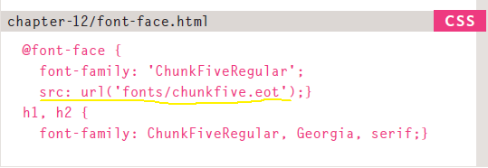

# Images, Color, Text
## Images
* The `` element is used to add images to a
web page.
  
* You must always specify a **src** attribute to indicate the source of an image and an **alt** attribute to describe the content of an image.
* You should save images at the size you will be using them on the web page and in the appropriate format.
  
* Photographs are best saved as **JPEGs**; illustrations or logos that use flat colors are better saved as **GIFs**.
* use the `align` attribute to position images, while texts folow around them.
  
  
## Color
* Color not only brings your site to life, but also helps convey the mood and evokes reactions.
* There are three ways to specify colors in **CSS**:
    1. **RGB** values 
    1. **hex** codes
    1. **color names**  
  
* Color pickers can help you find the color you want.  
  
* It is important to ensure that there is enough **contrast** between any text and the **background color** (otherwise people will not be able to read your content).  
  
* CSS3 has introduced an extra value for RGB colors to indicate **opacity**. It is known as **RGBA**.  
   
* CSS3 also allows you to specify colors as **HSL** values, with an optional opacity value. It is known as **HSLA**. Where H for **hue**, S for **saturation**, L for **lightness** and A for **alpha**
  
## Text
* There are properties to control the choice of **font**, **size**, **weight**, **style**, and **spacing**.  
  
* There is a limited choice of **fonts** that you can assume most people will have installed.
* If you want to use a wider range of typefaces there are several options, but you need to have the right license to use them.
* you can force a font to the browser by using `@font-face` attribute, which will download the font for the user, but you need to add a link for downloading the font style you want  
  
* You can control the space between lines of text,
individual letters, and words. Text can also be **aligned** to the **left**, **right**, **center**, or **justified**. It can also be **indented**.
* You can use **pseudo-classes** to change the style of an element when a user hovers over or clicks on text, or when they have visited a link.
  
## JPEG vs PNG vs GIF
* **PEG** vs **PNG** vs **GIF** formats together comprise of more than 95% of all images loaded on websites.
* there are two types of compressions:
    1. lossless, where tjere is no data loss after and before compression 
    1. lossy, where compression ratio is greater than lossless compression, but there is data loss in the process 

 **JPEG** | **PNG** | **GIF**  
 ---- | --- | ---  
format is for all images that contain a natural scene or photograph where variation in colour and intensity is smooth | format is for any image that needs transparency or for images with text & objects with sharp contrast edges like logos | format is for images that contain animations
is a lossy compression specification that takes advantage of human perception. It can achieve compression ratios of 1:10 without any perceivable difference in quality | is a lossless image format. No data is lost during compression and no compression artefacts are introduced in the image | is also a lossless image format. **GIF** images are mainly used only if the image contains animations.
images don’t support transparency and are hence not usable for background of logos and icons | images support transparency in two ways — inserting an alpha channel that allows partial transparency or by declaring a single colour as transparent |  images support transparency by declaring a single colour in the colour palette as transparent, but it's almost poor quality
images can support around 16 million colours. This is what makes them suitable for storing images of natural scenes |  images mainly have two modes — _PNG8_ and _PNG24_. _PNG8_ can support upto 256 colours whereas _PNG24_ can handle upto 16 million colours like a **JPEG** image | images are limited to 256 colours. If index transparency is used, then one of these 256 colours is assigned as transparent and the remaining 255 are used for other colours
 | - | - | only GIF supports animation 

