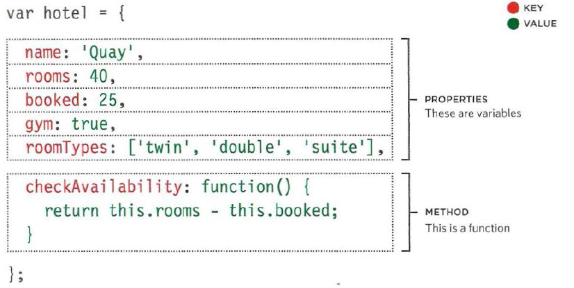
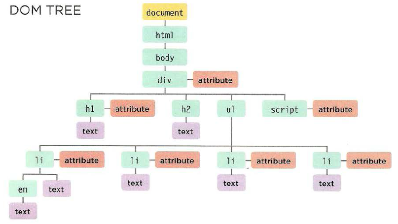
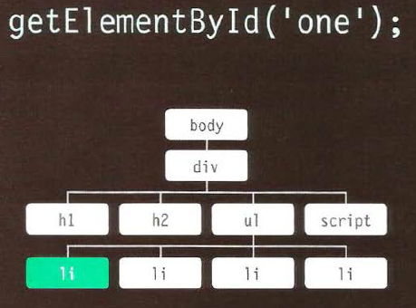
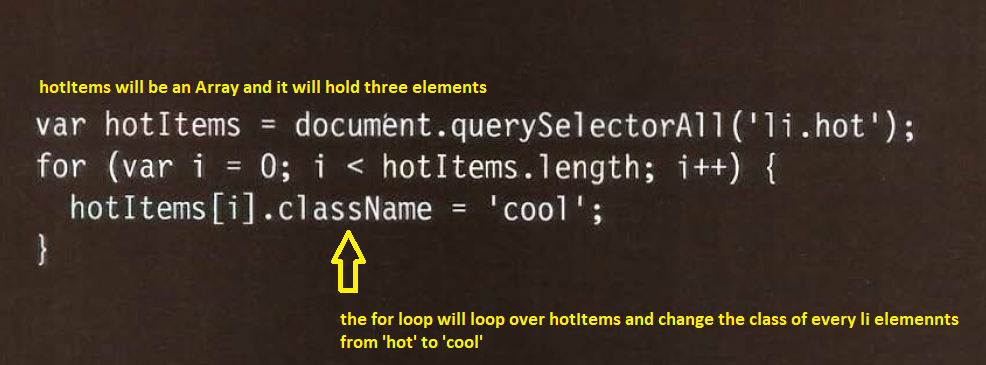
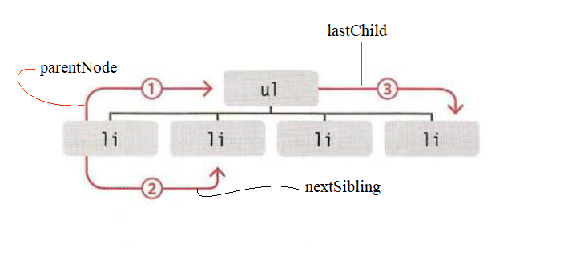
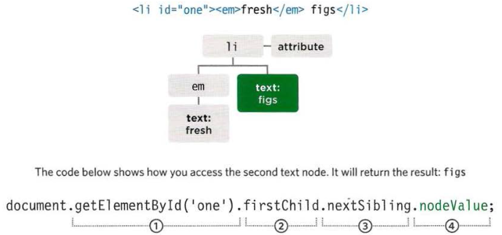
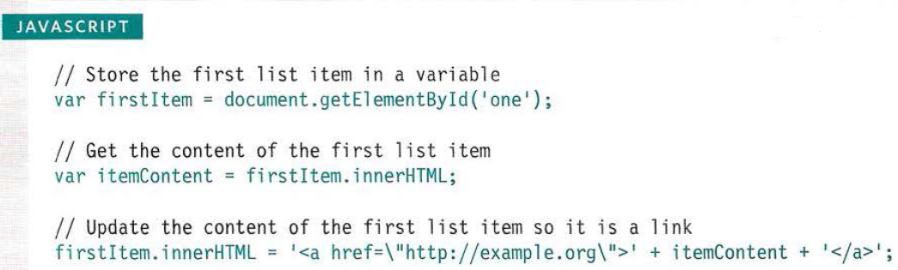
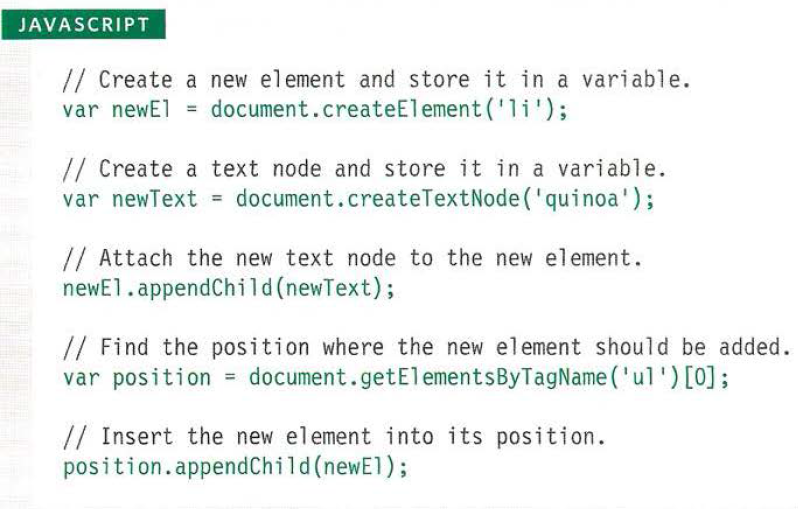
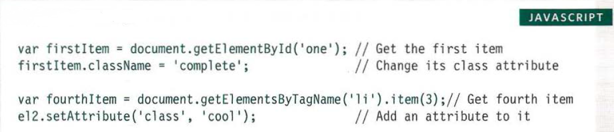

# Problem Domain, Objects, and the DOM
## Understanding The Problem Domain Is The Hardest Part Of Programming
* learning the problem domain is one of the hardest thing when programming.  
* coding is much easier when you understand the entirety of the problem domain you are coding to.  
* understanding the problem is the most critical piece to the equation.
* dividing the problem into several small pieces will ease the job always
* It is much more expensive and time consuming to do things over than it is to do them right the first time.
*   
   

## Objects
**objects** are a qroup of _variables_ and _functions_ that could represent any **_real world object_**
* **variables** in **objects** are called **properties**
* **functions** in **objects** are called **methods**
* to create an object we use curly brackets  
    

**properties value** in _objects_ can be numbers, booleans, strings or even any object and they are called **keys**
  
the values of **methods** in _objects_ are _always_ **functions**  
  
* you can access properties and methods by using either dot notations or square brackets
1. dot notation:  
  
1. square brackets:  
  
  
thrugh playing with **objects properties**, one object may represent many real _world object with the same utility_  

## Document Object Model (DOM)  
The Document Object Model (**DOM**) specifies how browsers should create a model of an **HTML** page and how **JavaScript** can access and update the contents of a web page while it is in the browser window.  
the **DOM** is not a part of **HTML** nor **JavaSccript**. it is a separate set of rules  
Here are the steps by which the **DOM** is built:  

### Creating the **DOM tree**:  
1. The browser abloads the **HTML**, **CSS** and **JavaScript** files or codes
1. The browser converts the **HTML** code into **Tokens** 
1. **Tokens** then convert into **Node Objects**
1. Finally the **DOM** is constructed from the **Nodes**, and it looks like a **tree**. this **tree** show the relation between element    
    
    
### Accessing and updating the DOM tree involves two steps:  
1. Locate the node that represents the element you want to work with.
2. Use its text content, child elements, and attributes.  

there are some methodsand properties to access elements of the DOM like:  
  
### Accessing elements in the tree  

1. accessing individual elements:  
  
    * `getElementByld()` : access and element by it `ID` 
    * `querySe1ector ()` : access the first matching element of a **CSS** `selector`

1. accessing a group of elements:
    * `getElementsByClassName()` : access all elements with a specific `class`
    * `getElementsByTagName()` : Selects all elements that have the specified `tag` name
    * `querySelectorAll()`: accessing all elements with a cerain `selector`

1. moving from one lement to another:  
    * `parentNode` : Selects the parent of the current element node (which will return just one element).
    * `previousSibling/nextSibling` : Selects the previous or next sibling from the DOM tree.
    * `firstChild/lastChild` : Select the first or last child of the current element.  

* the most common methods to access lements are **`getElementByld()`** and **`getElementsByClassName()`**  
  
### working with elements  
You can work with elements through:  
1. ACCESS/ UPDATE TEXT NODES: all texts inside elements are stored inside `text nodes`, and to access those elements you have to:  
    1. Select the `<li>` element  
    2. Use the `firstChild` property to get the text node
    3. Use the text node's only property `nodeValue` to get the text from the element, this property allows you to access and update a **text node**
      
1. WORK WITH HTML CONTENT : 
    * use `innerHTML` to access **child elements** and **text content**
    * use `textContent` to only **text content**
    * to create new nodes use `createElement()` `createTextNode()` `appendChild()`/`removeChild()`

1. ACCESS OR UPDATE ATTRIBUTE VALUES: to work with `className`/`id` attributes:-  
    * `hasAttribute()`: to check if an attribute exists
    * `getAttribute()` : to get an attribute value
    * `setAttribute()` : to update an attribute value
    * `removeAttribute()` : to remove an attribute
  
### Queries  
* you can get an element by its `id` by using `get ElementById()` method  
  
  
* store the element in a variable if you are gonna use more than one  
* `querySelector('css selector')` uses **CSS** selector syntax that would select one or more elements . This method returns only the first of the matching elements.
* you can get an element by its classs by using `getEl ementsByClassName('class')`.  
* `getElementsByTagName('tagName')` selects all elements on the page with the specified tag name. This method is faster than `querySe1ectorA11().`
* `querySelectorAll ('css selector')` uses **CSS** selector syntax to select one or more elements and returns all of those that match.  

* when a query return more than one element, then it returns a `Node List`.  

* The order in which the element nodes are stored in a `Node List` is the same order that they appeared in the HTML page.  
* `getEl ementsByClassName('class')`, `getElementsByTagName('tagName')`, `querySelectorAll ('css selector')` all return `Node Lists`
* you can select an element from a `Node List` by looping over it or by using its `index`(using squar brackets) directly or by a method.  
  
* through looping over `Node Lists` you can repeat actions over all of its elements
* you can select an element in relation to another element you previously selected by using these properties(these properies are **read only**):  
    1. `parentNode` 
    1. `previousSibling\nextSibling`
    1. `firstChild\lastChild`
      
  

the previouse **DOM** properties could cause problems due to the **browser** nature of giving the **white spacec** `text` elements 

### HOW TO GET/UPDATE ELEMENT CONTENT
* inside a text element there is a common property to use, which is `nodeValue`
* inside an element `node` :
    1. `innerHTML`: Gets/sets text & markup
    1. `textContent`: Gets/sets text only 
    1. `innerText`: Gets/sets text only 
  
sometimes it's complicated to access a text element:  
  
* `textContent` property can give you access to all `text elements` in a `node`  
* there are **two** methods of adding or removing content from a **DOM** tree:  
    1. `DOM manipulation`
    1. `innerHTML` property  
  
* **DOM** manipulation easily targets individual nodes in the **DOM** tree.
* `innerHTML` is better suited to updating entire fragments
* **DOM** manipulation is safer, but requires more **code** and can be **slower**
* Using the `innerHTML` property, you can access and amend the contents of an element, including any child elements.
* When adding new content using `innerHTML`, be aware that one
missing **closing tag** could throw out the design of the entire page. Even worse, if `innerHTML` is used to add content that your users created to a page, they could add malicious content.  
  
* we can add new content by **DOM** manipulation through:  
    1. Ceating an **element** by `createElement()`
    1. giving it a content by `createTextNode()`
    1. and then add it to the **DOM** by `appendChild()`  
      
* `document.write()` method is an easy way to add an element on the site but it has many disadvantages, and for that programmers avoid it
* If you add **HTML** to a page using `innerHTML` (or several `jQuery` methods), you need to be aware of **Cross-Site Scripting Attacks** or `XSS`; otherwise, an attacker could gain access to your users' accounts.
  
### CROSS-SITE SCRIPTING (XSS) ATTACKS
#### HOW XSS HAPPENS
**XSS** involves an attacker placing malicious code into a site. Websites often feature content created by
many different people. For example:  
* Users can create profiles or add comments
* Multiple authors may contribute articles
* Data can come from third-party sites such as Facebook, Twitter, news tickers, and other feeds
* Files such as images and video may be uploaded  
  
#### WHAT CAN THESE ATTACKS DO?
**XSS** can give the attacker access to information in:  
* The DOM (including form data)
* That website's cookies
* Session tokens: information that identifies you from other users when you log into a site  

This could let the attacker access a user account and:  
* Make purchases with that account
* Post defamatory content
* Spread their malicious code further/faster  
  
to further prevent **XSS** attacks. Never place any user's content in the following places without detailed experience of the issues involved
* Script tags: `<scr ipt>not here</script>`
* HTML comments: `<!-- not here -->`
* Tag names: `< notHere href=" / test" />`
* Attributes: `
`
* CSSvalues: `{color: not here}`  
  
* Any content generated by users that contain haracters that are used in code should be escaped on the server. You must control any markup added to the page.
  
### Attribute Nodes
once you select and element, you can do changes over its attribute by using the following methods:  
* `getAttribute()` : gets the value of an attribute
* `hasAttribute()`: checks if an element node has specified attribute 
* `setAttribute()` : sets the value of an attribute
* `removeAttribute()`: removes an attribute from an element node
  
and here some properties also:  
* `className` : gets or sets the value of the **class** attribute
* `id` : gets or sets the value of the **id** attribute  
  
here is an example of editing/changing class attribute by using a method and a propety:  
  
  
