# Object-Oriented Programming, HTML Tables
## Domain Modeling
**Domain** **modeling** is the process of creating a conceptual model in code for a specific problem.  

A **domain model** that's articulated well can verify and validate the understanding of a specific problem among various stakeholders.  

### Define a constructor and initialize properties
* to define the same properties between many objects, we use **functions** and we call them **constuctor functions**  
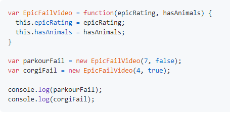  
*   1. The `new` keyword instantiates (i.e. creates) an object.
    2. The constructor function initializes properties inside that object using the `this` variable.
    3. The object is stored in a variable for later use.  
* we use `Math.random()` to do that  
* `ptototype` is a subtitute for an **Object** and it can have methods 
* `Math.random()` function returns a random number less than **1**
* `Math.floor` function returns the largest integer less than or equal to a given number  
* the `this` variable, methods can access any property or method on the same object that called the `dailyLikes()` method
* `Math.round()` function returns the value of a number rounded to the nearest integer

## Tables
* **tables** and **grids** are very important when representing data.  

* there are three main components in tables:  
    1. **Rows**
    1. **columns**
    1. **captions** for either rows or columns or both  
* **Tables** are **block** elements
* we use `<table>` tag to create a table. The contents of the table are written out row by row.
* and we use `<tr>` tag to indicate the stert of each row
* we use `<td>` to write text inside columns. this tag is put inside `<tr>` tag  
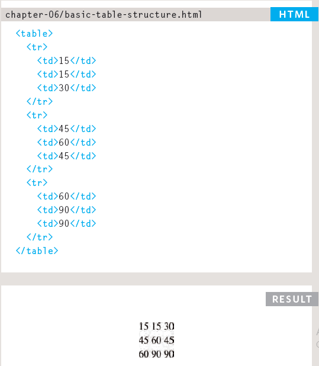  
* we use `<th>` to represent the heading for either a column or a row. (The th stands for table heading.)
* Even if a cell has no content, you should still use a `<td>` or `<th>` element to represent the presence of an empty cell otherwise the table will not render correctly. (The first cell in the first row of this example shows an empty cell.)  
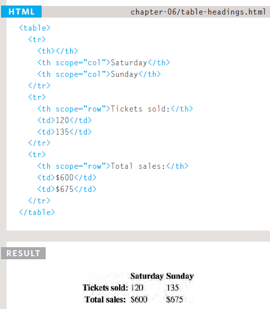  
* we use the `colspan attribute` to stretch a certain value in a table, so it takes more that one **column** (`<td colspan="2">Geography</td>`)  
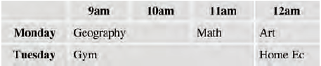  
* we use the `rowspan attribute` to stretch a certain value in a table, so it takes more that one **row** (`<td rowspan="2">Movie</td>`)  
   
* There are three elements that defines the main content of the table:
    1. `<thead>` where the headings of the table should sit inside
    1. `<tbody>` where the main content should sit inside
    1. `<tfoot>` where the footer should sit  
      
    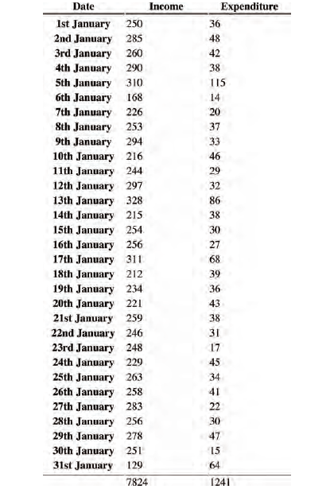  
  
## Functions, Methods, and Objects
while programms contains hundereds or even tousands od code lines, programmers use functions, methods, and objects to organize their code, and make them easier to access and faster to upload on usre browsers.  
### Functions
* **function** is a qroup of code statements that are reusable, that runs togather. **functions** can return values or return nothing(consoling something for example)
* some **functions** take parameters to work
* **functions** have names
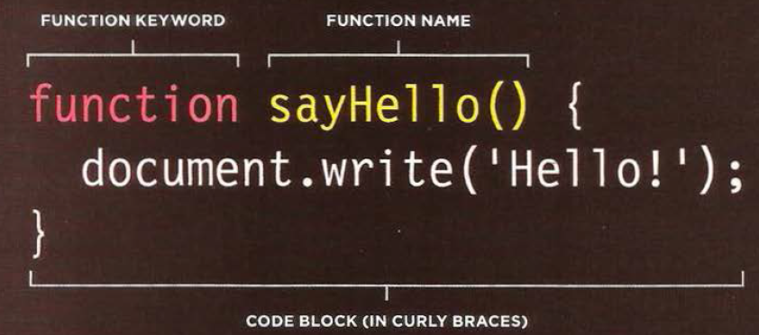  
* **functions** must be called to be utilized
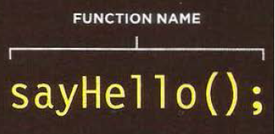  
* there are two methods to create functions:
    1. FUNCTION DECLARATION
    1. FUNCTION EXPRESSION
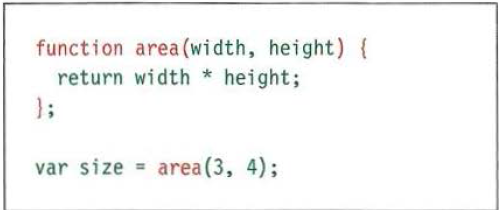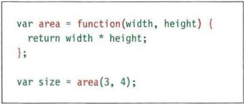  
* **functions expressions** are needed when a function is going to be called once
* we two type of scopes for variables:
    1. local variables
    1. global variables
* **local** **variable** are created inside functions, and can only be useded where they where created, or in children functions
* **global** **variables** are created outside functions, and can be used everywhere
* errors will happen if two **global variable** names are the same. however, if a **local variable** and a **global variable** have the same name, then no errors occur
* **Global** **variables** use more memory. The browser has to remember them for as long as the web page using them is loaded. **Local variables** are only remembered during the period of time that a function is being executed.
* the more memory your script use, the slower yor site will run
* using  **Global** **variables** might cause naming collisions.
  
### Objects
**objects** are a qroup of _variables_ and _functions_ that could represent any **_real world object_**
* **variables** in **objects** are called **properties**
* **functions** in **objects** are called **methods**
* to create an object we use curly brackets  
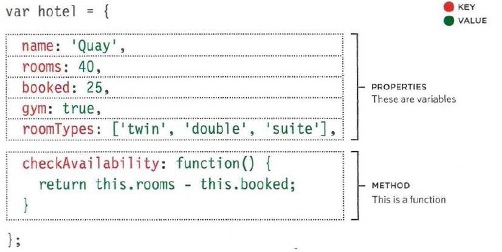    

**properties value** in _objects_ can be numbers, booleans, strings or even any object and they are called **keys**
  
the values of **methods** in _objects_ are _always_ **functions**  
  
* you can access properties and methods by using either dot notations or square brackets
1. dot notation:  
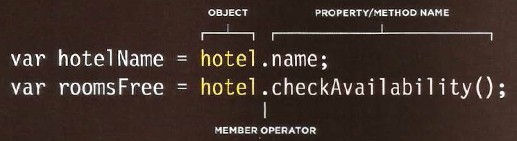  
1. square brackets:  
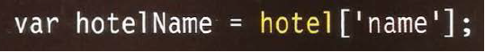  
  
thrugh playing with **objects properties**, one object may represent many real _world object with the same utility_ 
* we use `new` property and **the object constructor** to create blank objects
* we have the ability to add `methods` and `properties` to **abjects**  
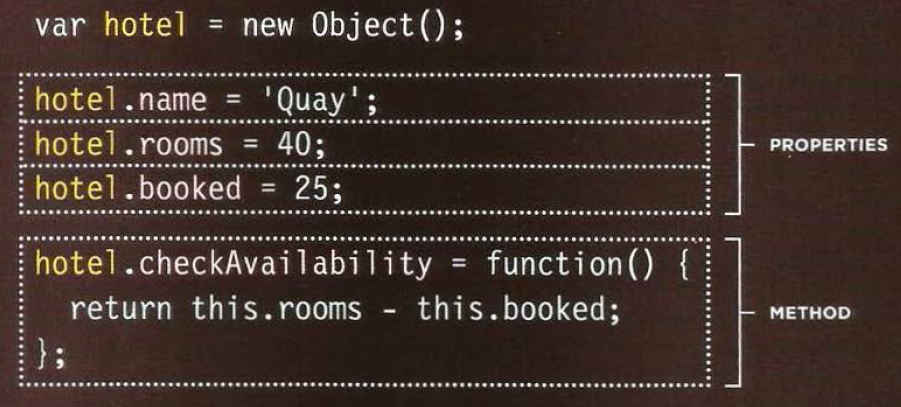  
* to update the value of properties we use either **dot notation** or **square brackets**  
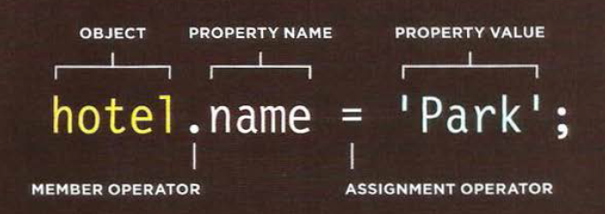  
* to delete a property we use the `delete` keyword or we assign an empty string to the value we want to delete
* to create several objects that share the same properties, use function **template** as a function constructor. And then create an object by utilizing the `new` keyword using with it the **template** function and the properties value  
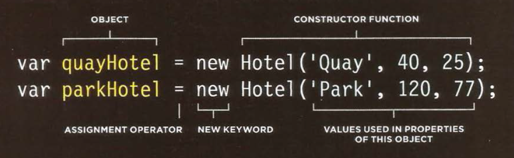  
* we can also use **constructor syntax** to create objects  
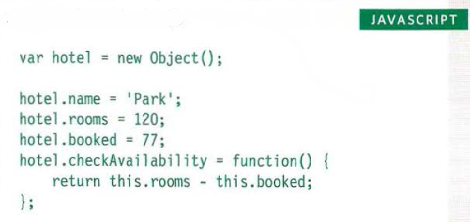  
* you can **add** ot **delete** properties to existent objects by using the **dot notation**
* `this` keyword always refers to one object, usually the object in which the function operates.
* `this` reference value change accoring to its use and location.
  
#### RECAP: STORING DATA
* every data stored in **JS** has a **key** and a **value**
* **Variables** keys is thier name, and thier values can be assigned a value or undefined.
* To retrieve the value of a variable, use its name: (`variable ;`)
* **Arrays** store multiple pieces of information
* Values in an **array** are put in square brackets, and thier keys is the `index` number.
* To retrieve an item, use its `index` number: (`array[2]`)
* **Objects** store sets of name/value pairs. They can be `properties` (variables) or `methods` (functions).
* In **object** literal notation, `properties` and `methods` of an object are given in curly braces: (`let Obj={elm1, elm2, etc}`)
* When you need to create multiple objects within the same page, you should use an**object constructor** to provide a template for the objects. 
* **Arrays** ate special type of Object, this :(`obj={num1:1,num2:2,num3:3}`) is the same as this :(`arr=[1,2,3]`)
* **objects** can hold **arrays** as `properties`, and **arrays** can cold inside them **objects** as `elements`.  
* **Browsers** come with a set of built-in objects that represent things like the browser window and the current web page shown in that window. These built-in objects act like a _toolkit_ for creating interactive web pages.
* when an **object** is nested inside another **object**, we call it **child object**
  
### Browser Object Model  
The window object represents the current
browser window or tab. It is the topmost object
in the Browser Object Model, and it contains
other objects that tell you about the browser.  

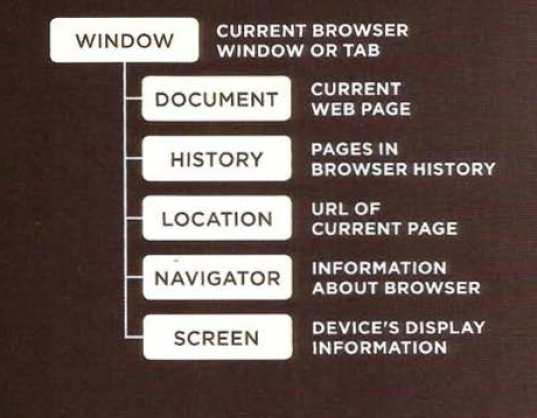  
 

### Document Object Model 
The topmost object in the Document Object Model (or DOM) is the document object. It represents the web page loaded into the current browser window or tab.  
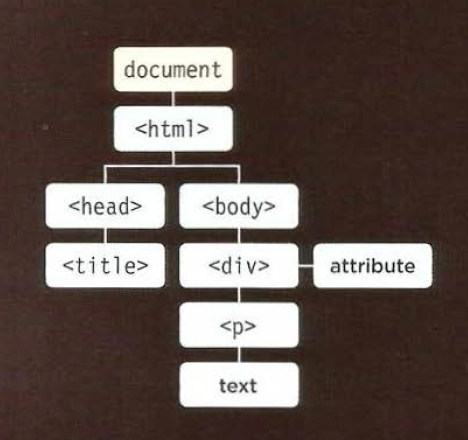 
* The **DOM** is vital to accessing and amending the contents of the current web page. 

### Global Objects   
**Strings**:  
* Whenever you have a value that is a **string**, you can use the properties and methods of the String object on that value.  
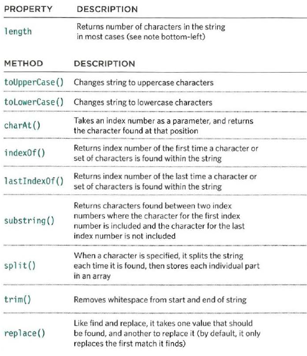  
* Each character in a **string** is automatically given a number, called an **index** number. Index numbers always start at **zero**
  
**Numbers**:  
Whenever you have a value that is a **number**,
you can use the methods and properties of the
Number object on it.  
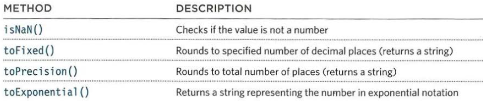  
  
**Math object**  
The Math object has properties and methods for mathematical constants and functions.  
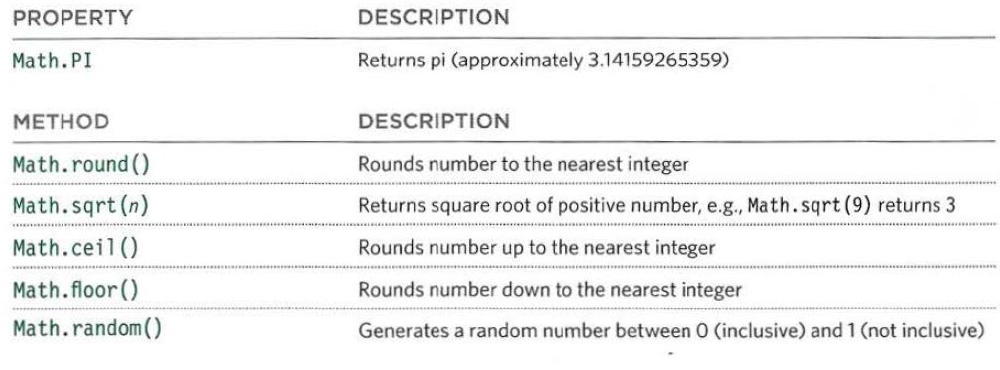  
  
**Date Object**  
To represeant **dates**, you create an **Date object**, and then preseant the date you want to show  
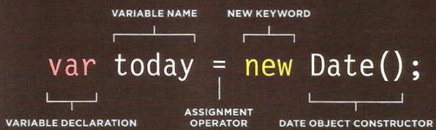  
* Once you have created a **Date object**, the following methods let you set and retrieve the time and date that it represents.  
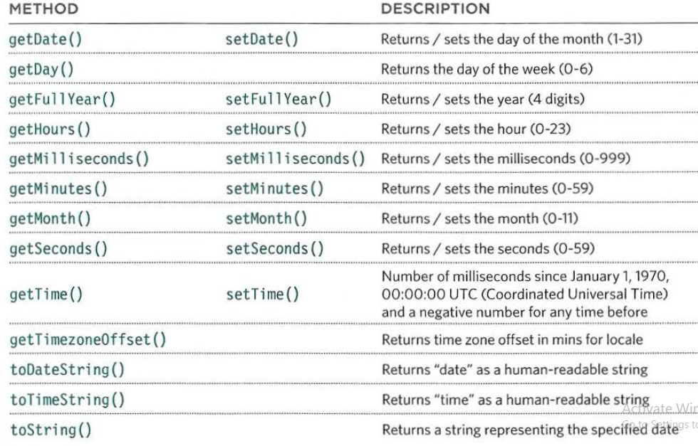  
