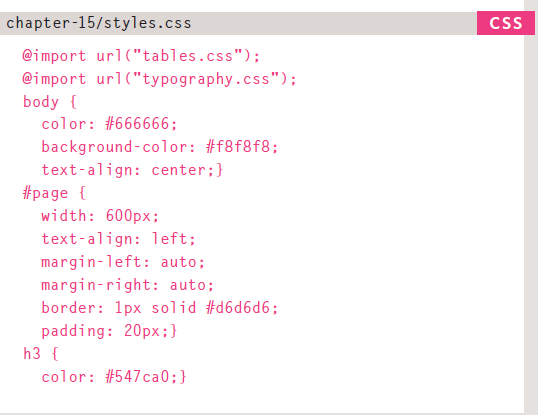

# More CSS Layout
## Layout
* each element in **HTML** is treated as a box, either an **block-level box** or an **inline box**
* elements that contains other lements are called **parent elements**
* **CSS** allows you to control the position of all elements in your site
* the default positioning in browsers is called **normal flow**, where each element sits over the following element
* through `position:relative` you can move an element in relation to its normal flow position,where you determine the top,right,left,bottom positions.
* through `position:absolute` you make an element **static** so all elements will ignore its position and might overlap with it.
* you can make an element position fixed no matter the user scroll and with no overlapping with other lements through `position:fixed` 
* when elements overlap, you can deside what element apear in front through `z-index`
* you can make an element flow to any edge or side on the user screen through `float`, and all other elements will flow aroung that element when trying to overlap it. also, you should define the **dimensions** of the element you wanna make float.
* you can make elements float beside each other through defining thier **width** and giving them `float` property.
* through `clear` property you can prevent elements from touching the box of a certain element. this property can take the following values:(_left,right,both,none_)
* you can create **Columns** through using `
` element as a container, and then applying properties like **float**, **margin**,etc.
* **Resolution** refers to the number of dots a screen shows per inch
* poeple use different screens to view your site.
* you can use **percentages**, **pixeles** or other measuring units but **pixeles** and **percentages** are preffered
* * using **percentages** as a unit will make your elements viewed in a liquid way.
* you can separate your style sheet by using `@import` to import style shhets within a style sheet. or you can link many style sheets through using `<link>` tag
  