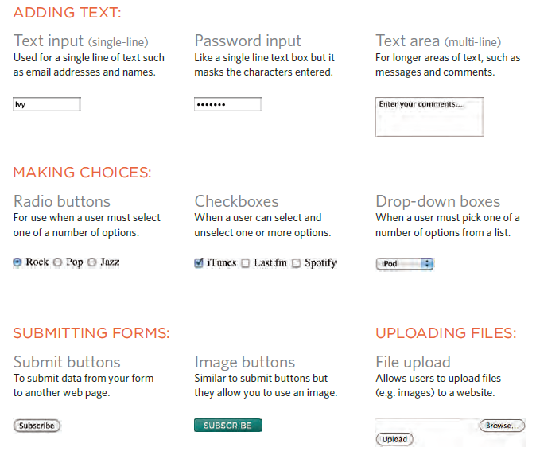
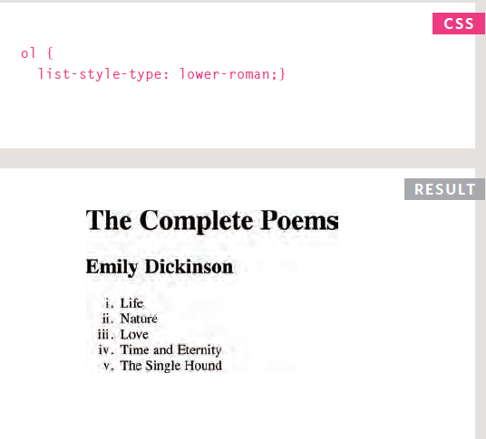
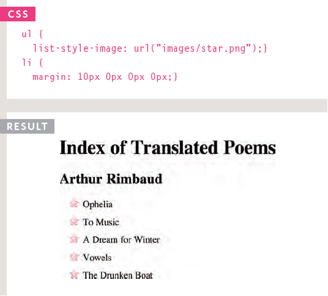
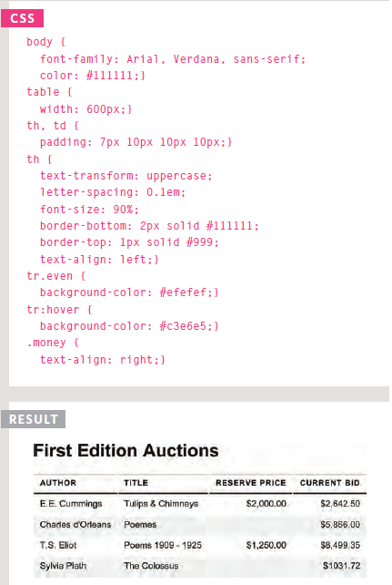
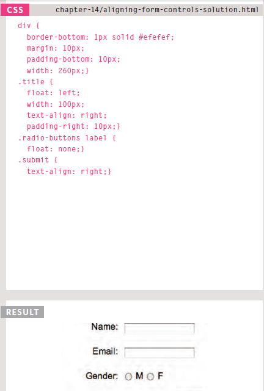

# Forms and JS Events

## Forms

- Whenever you want to collect information from visitors you will need a from, which lives inside a `<form>` element

- Information from a form is sent in name/value pairs

- After a user enter/choose an input, the name of each form control is sent to the server along with the value the user enters or selects. Then, the server processes the information using a programming language such as PHP, C#, `VB.net`, or Java. It may also store the information in a database.

- Each form control is given a name, and the text the user types in or the values of the options they select are sent to the server

- HTML5 introduces new form elements which make it easier for visitor to fill in forms
- there are 9 types of **form** inputs:  
    1. Text input
    1. Password input
    1. Text area (multi-line)
    1. Radio buttons
    1. Checkboxes
    1. Drop-down boxes
    1. Submit buttons
    1. Image buttons
    1. File upload  
      

## Lists, Tables & Forms

- In addition to the CSS properties covered in the chapters which work with the contents of all elements, there are several other that are specifically used to
control the appearance of lists, tables, and forms.

- List markers can be given different appearances using the list-style-type and list-style image properties  
  
  

- Table cells can have different borders and spacing in different browsers, but there are properties you can use to control them and make them more consistent  
  

- Forms are easier to use if the form controls are vertically aligned using CSS  
 

- Forms benefit from styles that make them feel more interactive  
  
 

## Events

- Events are the browser's way of indicating when something has happened (such as when a page has finished loading or a button has been clicked)

- Binding is the process of stating which event you are waiting to happen, and which element you are waiting for that event to happen upon

- When an event occurs on an element, it can trigger a JS function. When this function then changes the web page in some way, it feels interactive because it has responded
to the user

- You can use event delegation to monitor for events that happen on all of the children of an element

 

