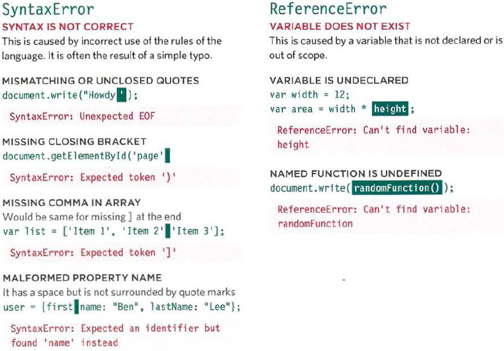
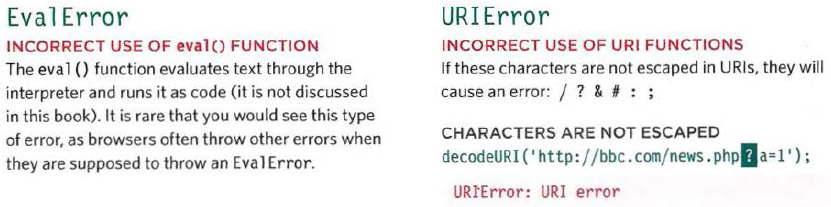
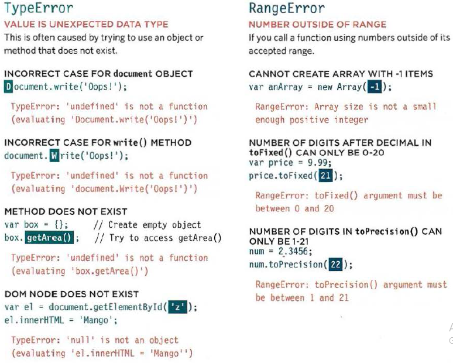
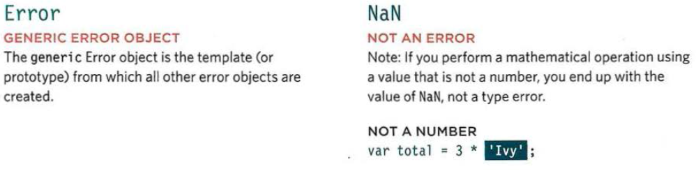
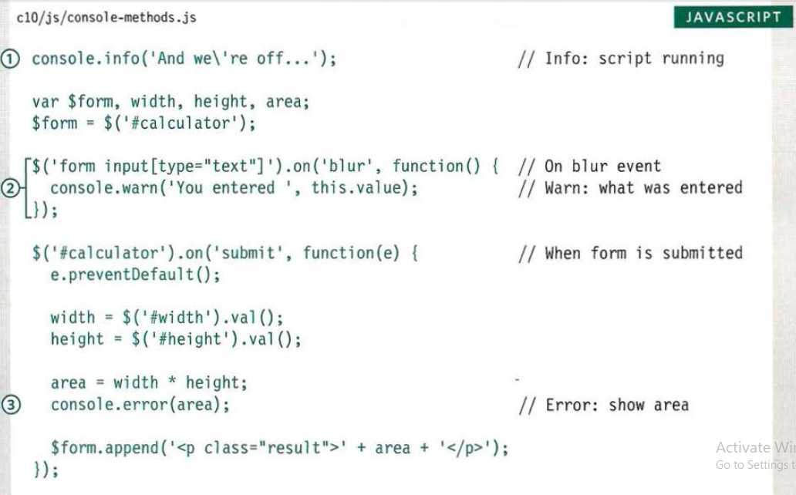

# Debugging
## Error Handling & Debugging
When writing a long script, nobody gets everything right in their first attempt. The error
messages that a browser gives look cryptic at first, but they can help you determine what
went wrong in your JavaScript and how to fix it.  

### ORDER OF EXECUTION  
The **browser** runs any code in chronological order. If any part of the code is faulty, then browser will stop.  

**EXECUTION** **CONTEXT**
1. GLOBAL CONTEXT : Code that is in the script, but not in a function
1. FUNCTION CONTEXT : Code that is being run within a function
1. EVAL CONTEXT : NOT my business :P  

**VARIABLE SCOPE**  
1. GLOBAL SCOPE : variables that are declared outside a function, they can be used anywhere
1. **FUNCTION-LEVEL SCOPE** : variables that are declared within a function, they can only be used within that function  

### The Stack
when a function is run and it demands data to process, the browser put that function on hold until the data is ready, and continue to run the code after the function  

### EXECUTION CONTEXT & HOISTING
However, the **order of execution** is not strait forward. Because functions are **Hoisted** in **JavaScript**.  

**Hoisting** is the browser creating the functions before running the code.

From **Hoisting** you can do the following:  
- Call functions before they have been declared
(if they were created using function declarations not function expressions, see p96)
- Assign a value to a va ria ble that has not yet been
declared  

### UNDERSTANDING SCOPE
In nested functions(`function1(){var1 // function2(){var2 // function3(){var3}}}`), The children can ask the parents for information in their variables. But the parents cannot get variables from their children(`function3` can get access to `var2` and `var1` but `function1` only has access to `var1`)  

### UNDERSTANDING ERRORS  
If a **JavaScript** statement generates an **error**, then it throws an exception. At that point, the **interpreter** stops and looks for exception-handling code.  

### ERROR OBJECTS
**Error** objects can help you find where your mistakes are
and browsers have tools to help you read them.  
  
  
### ERROR OBJECTS CONTINUED
  
  
  
  

### HOW TO DEAL WITH ERRORS
To fix an **Error** :  
* DEBUG THE SCRIPT TO FIX ERRORS : You will find that the **developer** **tools** available in every major modern browser will help you with
this task.
* HANDLE ERRORS GRACEFULLY: Sometimes, an error may occur in the script for a reason beyond your control. For example, you might request data from a third party, and their server may not respond. In such cases, it is particularly important to write error-handling code.  

### A DEBUGGING WORKFLOW
Debugging is about deduction: eliminating potential causes of an error. Here is a workflow for techniques. Try to narrow down where the problem might be, then look for clues.  
Here are some pint to focus on to solve errors:  

-  WHERE IS THE PROBLEM?
-  WHAT EXACTLY IS THE PROBLEM?  

### TYPING IN THE CONSOLE IN CHROME
you can type on the **console** to see to clear what is the problem and even solve before altering the original code  

* **console** is also perfect to test new styles with **CSS**  

you can also enter **data** and define new **variables** in the **console**  

### MORE CONSOLE METHODS
There are some helpful method to type at the console like:  
1. `conso1e.info()` can be used for general information
2. `console.warn()` can be used for warnings
3. `console.error()` can be used to hold errors  
  
  
* **JavaScript** has **7** different types of **errors**. Each creates its own error object, which can tell you its line number and gives a description of the error.
* If you know that you may get an **error**, you can handle
it gracefully using the `try`, `catch`, `finally` statements.
Use them to give your users helpful feedback.
 