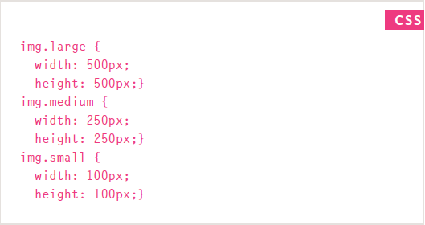
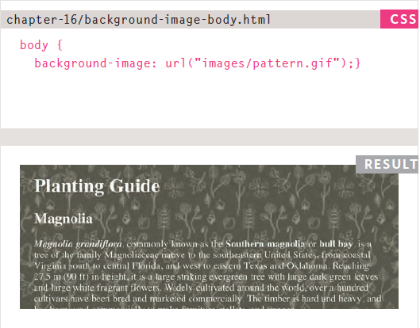
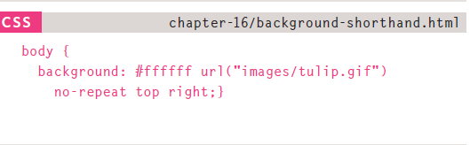
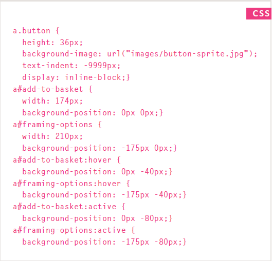
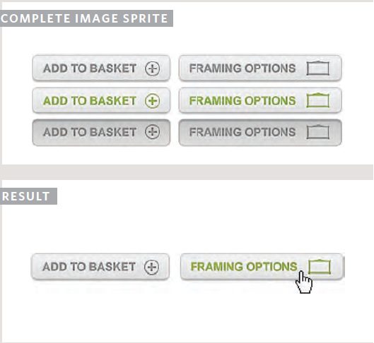
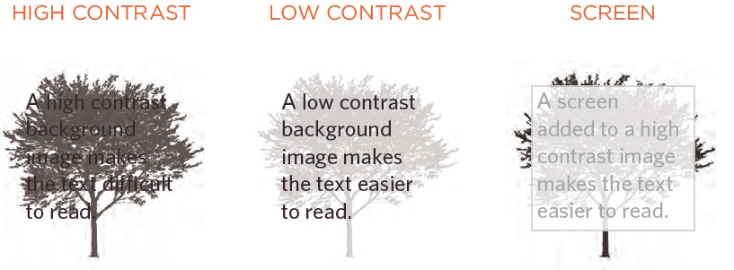

# Audio, Video, Images
## Images
through **CSS** when can control images size and we can play with how it will affect our presentation.  

### Controlling sizes of Images in CSS 
* You can control the size of an image using the `width` and
`height` properties in **CSS**, just like you can for any other box.
* you can use percentages or pixels to define images `width` and `height`    
  
  

### Aligning images Using CSS
* developers uses `float` property to control the alignment of images nowadays, and `align` property is forsaken  
  
  

### Centering images Using CSS
* to to make an image at the center you need to display it first as a block element using the `display : block` rule set, then assigning the `margin` to `auto`  
  
### Background Images
* to use an image as a background, you can attach an image URL to the `background-image` property
  
  
### Repeating Images
you can play with the background image with the `background-repeat` property, and it has 4 value:  
1. repeat : The background image is repeated both horizontally and vertically
1. repeat-x : The image is repeated horizontally only
1. repeat-y : The image is repeated vertically only.
1. no-repeat : The image is only shown once. And the `background-attachment` property specifies whether a background image should stay in one position or move as the user scrolls up and down the page by choosing between **fixed** and **scroll**
  
### Background Position
When an image is not being repeated, you can use the `background-position` property to specify where in the browser window the background image should be placed. This property has the following values:  
* left top
* left center 
* left bottom
* center top
* center center
* center bottom
* right top
* right center
* right bottom 
- you either choose 2 values (one for vertical and one for horizontal) or choose one and the second one will be default to `center`  
  
### shorthand
you shorthand all background properties in one line using the `background` property alone.  
  
  
### Image Rollovers & Sprites   
Using **CSS**, it is possible to create a link or button that changes to a second style when a user moves their mouse over it (known as a rollover) and a third style when they click on it.  
  
  
  
### Contrast of background images
contrast is very important, without the right amount of it, seeing your contents will become a hassle.  
  
  
  

## Practical Information
- **Search engine optimization** helps visitors find your sites when using search engines.

- Analytics tools such as **Google Analytics** allow you to see how many people visit your site, how they find it, and what they do when they get there.

- To put your site on the web, you will need to obtain a domain name and web hosting.

- **FTP** programs allow you to transfer files from your local computer to your web server.

- Many companies provide platforms for blogging, email newsletters, e-commerce and other popular website tools.
  
  
## Video and Audio APIs
### HTML5 video and audio
* The `<video>` and `<audio>` elements allow you to embed video and audio into web pages
  
ex:) `<video controls>`
  `<source src="rabbit320.mp4" type="video/mp4">`
  `<source src="rabbit320.webm" type="video/webm">`
  `
`Your browser doesn't support HTML5 video. Here is a `<a href="rabbit320.mp4">link to the video</a>` instead.`
`
`</video>`
  

### The HTMLMediaElement API
* API provides features to allow you to control video and audio players programmatically like :  `HTMLMediaElement.play()`, `HTMLMediaElement.pause()`
* you can add videos and design display button for it by **HTML**, **CSS** and **JavaScript**
* The **HTMLMediaElement** **API** makes a wealth of functionality available for creating simple video and audio players, and that's only the tip of the iceberg. See the "See also" section below for links to more complex and interesting functionality.