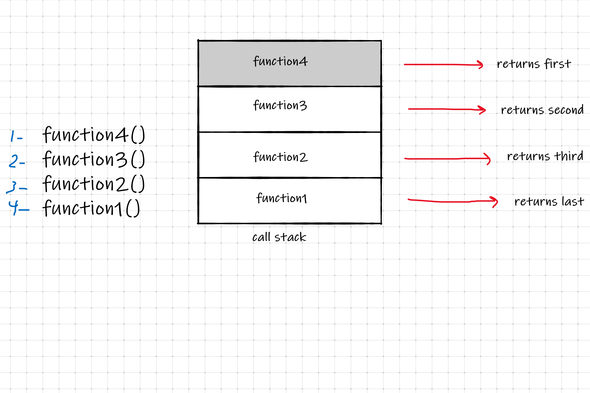

# In memory storage  

### Content  
1. [Call Stack](#Call-Stack)
1. [Error & Debugging](#Error-&-Debugging)

---

## Call Stack 

A **call** is an abbreviation for **call stack**, which is used for function invocation.  

**call stack** is single, which means that the execution of function is one at a time (multiple function can not be executed at the same time)  

A **call stack** is a data structure that uses the Last In, First Out (**LIFO**) principle to temporarily store and manage function invocation (**call**).  

The Last In, First Out (**LIFO**) means, that when calling a group of functions, the last function to be called is the first one to return its result.  

ex)  
  

A stack **overflow** occurs when there is a recursive function (a function that calls itself) without an exit point. The browser (hosting environment) has a maximum stack call that it can accommodate before throwing a stack error

---
## Error & Debugging

### Reference errors  

This error appears when an undefined variable is used like:  

```
let x = 10;

console.log(x + y)

// y is not yet defined
```


### Syntax errors  
This error occur when a something is written wrong in the code like:  
```
const fun = function {
    return a+b;
}

// it should be:
let fun = function() {
    return a+b;
}
```

### Range errors  

This error occur when trying to manipulate an object with some kind of length and giving it an invalid length like :  

```
let array = [1,2,3,];
array.length = array.length - 4;

// arrays can not have negative length

```


### Type errors  

This error occur when types (number, string and so on) you are trying to use or access are incompatible, like accessing a property in an undefined type of variable.  

```
var foo = {}
foo.bar // undefined
foo.bar.baz // Uncaught TypeError: Cannot read property 'baz' of undefined

```

>When ever these errors appears and trying to debug them, the ;ine where the error happens is called **breakpoint**, which breaks your code and make you bang your head against the wall !

>We use in our code the **‘debugger’** to check fo errors, by putting it at the point we want to break. This method will show in steps how each code is run and also, show statistics of the code. 


---
### Resources

- [Understanding the JavaScript Call Stack](https://www.freecodecamp.org/news/understanding-the-javascript-call-stack-861e41ae61d4/)
- [JavaScript error messages](https://codeburst.io/javascript-error-messages-debugging-d23f84f0ae7c)