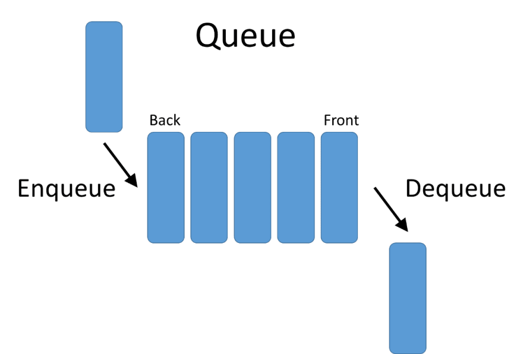

# Stacks and Queues  

### Content  
- [What is a Stack](#what-is-a-stack)
- [What is a Queue](#what-is-a-queue)
-   
---
## What is a Stack  
A stack is a data structure that consists of `Nodes`. Each `Node` references the next Node in the stack, but does not reference its previous.  

### Terminology:
term | definition | performance
--- | --- | ---
Push | Nodes are put in top of the stack. | time : O(1)
Pop | Top node of the stack is removed. | time : O(1)
Top | The final node to enter the stack. | time : O(1)
Peek | Getting the value of a top node in a stack. | time : O(n)
IsEmpty | Returning `true` if a stack is empty. | time : O(1)  

### Conceptions  
Stacks follow the rules of `filo` or `lifo`, which means that the **last** node to enter the stack is the **first** node to exit the stack.  

---
## What is a Queue  
### Terminology  
term | definition | Performance
--- | --- | ---
Enqueue | Nodes or items that are added to the queue. | O(1)
Dequeue | Nodes or items that are removed from the queue. If called when the queue is empty an exception will be raised | O(1)
Front | This is the front/first Node of the queue. | -
Rear |This is the rear/last Node of the queue | -
Peek | viewing the front node of the queue | O(1)
IsEmpty | returns true when queue is empty otherwise returns false  | O(1)  

### Conceptions
The **Queue** follow the rules of `LILO` or `FIFO`, when means that the first item in the queue will be the first item out of the queue  

---  
### Resources  
[Stacks and Queues](https://codefellows.github.io/common_curriculum/data_structures_and_algorithms/Code_401/class-10/resources/stacks_and_queues.html)