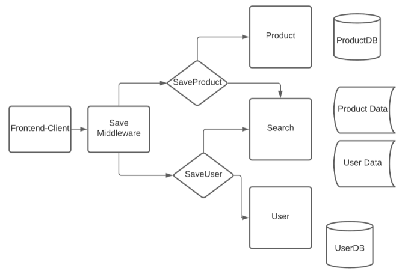

# Express REST API  

### Content
1. [Review, Research, and Discussion](#review-research-and-discussion)
1. [Vocabulary Terms](#vocabulary-terms)
1. [Preview](#preview)
1. [Resources](#resources)

## Review, Research, and Discussion  
### Common Use Cases for Middleware 
1. Translator  
  

1. Accumulating-Duplicating Data
  

1. API Security  
  We can use middleware as a proxy to conceal our authentication server's URL.

### True or false: The route handler is middleware?  
I would say **false**. Though, they both behave similar. **Handler** functions are the ones that send responses, while **middleware** do not.  

### In what ways can a middleware function end the process and send data to the browser?  
In 2 ways:  
- Throwing an error `throw new Error(‘error message’)`  
- `next('error message')`  

### At what point in the request lifecycle can you “inject” middleware?  
The generated server allows for 3 extension points to inject middleware in its middleware chain. These are:
1. to add middleware all the way to the top of the middleware stack. 
2. right before actually handling a matched request.
3. setting the middleware for existing handler by its route and HTTP method. It can be done in the configureAPI function by calling api.AddMiddlewareFor method.  

### What can cause express to error with “Request headers sent twice, cannot start a second response”  
The request handler function already sent a response to the client using the res.json() method which automatically sets the response header(every response to the client should contain headers) for the response(in this case theContent-Type to application/json). Node picks up this atrocity and our server crashes because express under the hood is attempting to set the response header for this second response.  
[Top](#content)  

## Vocabulary Terms  
- `Middleware`
- `Request Object`
- `Response Object`
- `Application Middleware`
- `Routing Middleware`
- `Test Driven Development`
- `Behavioral Testing`  
[Top](#content)

## Preview  
1. Which 3 things had you heard about previously and now have better clarity on?    
  - Databases.
  - APIs.
  - Request cycle.
1. Which 3 things are you hoping to learn more about in the upcoming lecture/demo?  
  - noSQL
  - Authentication
  - middleware usage
1. What are you most excited about trying to implement or see how it works?  
  - middleware functions  
[Top](#content)
### Resources
- [What is Middleware? Definition and Example Use Cases](https://www.freecodecamp.org/news/what-is-middleware-with-example-use-cases/)  
- [wesleytodd](https://github.com/expressjs/express/issues/4089)
- [Understanding Node Error](https://www.codementor.io/@oparaprosper79/understanding-node-error-err_http_headers_sent-117mpk82z8)