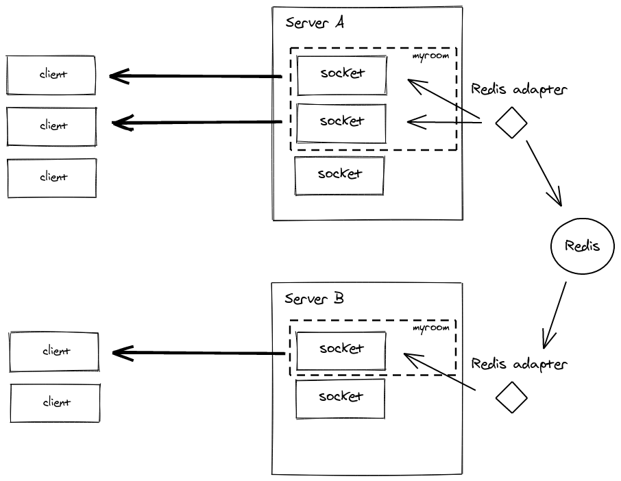

# Message Queues  
### Content  
1. [Review, Research, and Discussion](#review-research-and-discussion)
1. [Term](#term)
1. [Preparation Materials](#preparation-materials)  
---  
## Review, Research, and Discussion  
#### What does it mean that web sockets are bidirectional? Why is this useful?  
It mean there are two way connection from client to server and, from server to client. Thus, the webSocket increases speed and real-time capability on the web. WebSockets also enable servers to keep track of clients and “push” data to them as needed, which was not possible using only HTTP.
#### Does socket.io use HTTP? Why?  
Yes, the initial connection setup is done over HTTP.
#### What happens when a client emits an event?  
The event gets passed to the server through websockets along with its payload, and an event handler on the server listening to the event is executed. 
#### What happens when a server emits an event?  
Normally, it means that the server have finished executing a previous event handler ot processing some data, and it emits an event along with a payload to deliver the data to be rendered ot further processed by the client.
#### What happens if a client “misses” an event?  
it stored in queue until the client get opportunity to listen the event.
#### How can we mitigate this?  
we can push a missed event to the Buffers until it is used.   

---  
## Term  
- `Socket` :   
  > a socket is an endpoint of a communication between two programs running on a network. Sockets are used to create a connection between a client program and a server program  
- `WebSocket` : 
  > The WebSocket object provides the API for creating and managing a WebSocket connection to a server, as well as for sending and receiving data on the connection.  
- `Socket.io` :  
  > Socket.IO is a library that enables real-time, bidirectional and event-based communication between the browser and the server.  
- `Client` :  
  > The Clients interface provides access to Client objects.  
- `Server` :  
  > framework can be used to develop web servers using the ‘http’ module.  
- `OSI Model` :  
  > The OSI model is an architectural model that represents networking communications.  
- `TCP Model` :  
  > is a suite of communication protocols used to interconnect network devices on the internet. 
- `TCP` :  
  >  a standard that defines establishing and maintaining a network conversation through which application programs can exchange  
- `UDP` :  
  > is part of the TCP/IP suite of protocols used for data transferring.  
- `Packets` :  
  > it is a form of data that consists of a small amount of information with a port number, IP addresses to the sender and the caller, and a tail part that contains some protocol information.  
---  
## Preparation Materials   
### Rooms
A **Room** is an arbitrary channel that sockets can join and leave. It can be used to broadcast events to a subset of clients. And, rooms are a server-only concept (i.e. the client does not have access to the list of rooms it has joined). 
  
  
- `join` method is used subscribe the socket to a given channel like:   

```
io.on('connection', socket => {
  socket.join('some room');
});  

```  
`in` and `to` are used when broadcasting or emitting:  

```
io.to('some room').emit('some event');

```  
- Emiting to several rooms is possible :  

```
io.to('room1').to('room2').to('room3').emit('some event');

```  
### Default room  
Each **Socket** in `Socket.IO` is identified by a random, unguessable, unique identifier Socket#id. For your convenience, each socket automatically joins a room identified by its own id.  

```
io.on("connection", socket => {
  socket.on("private message", (anotherSocketId, msg) => {
    socket.to(anotherSocketId).emit("private message", socket.id, msg);
  });
});  

```  
### Disconnection  
Upon disconnection, sockets leave all the channels they were part of automatically, and no special teardown is needed on your part.  

```
io.on('connection', socket => {
  socket.on('disconnecting', () => {
    console.log(socket.rooms); // the Set contains at least the socket ID
  });

  socket.on('disconnect', () => {
    // socket.rooms.size === 0
  });
});  

```  
  

[Top](#message-queues )