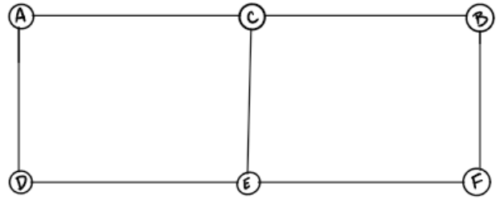
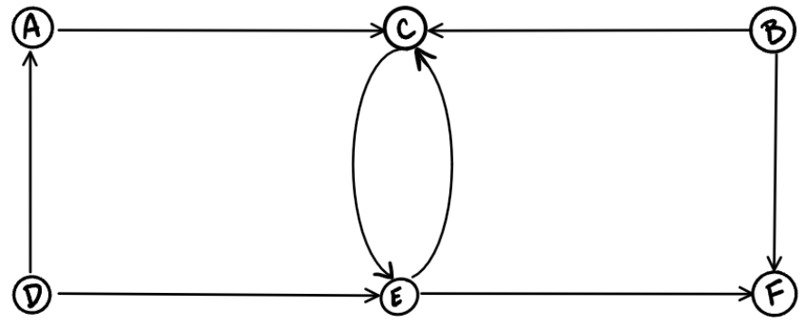
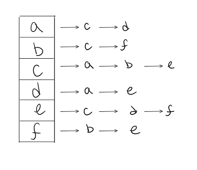
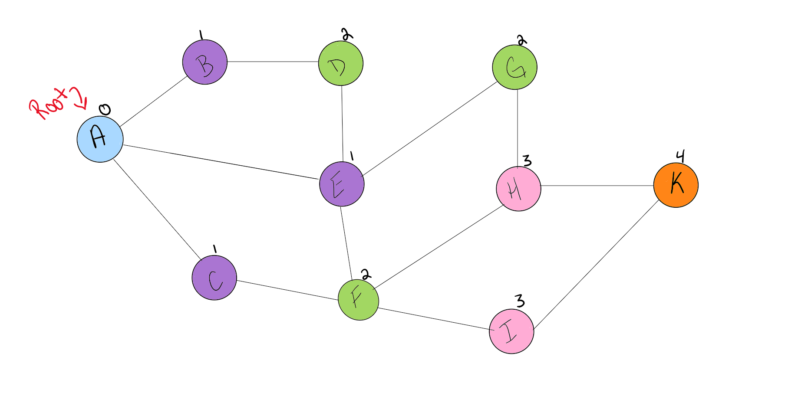

# Graphs

### Content

1. [Introduction](#introduction)
1. [Terminology](#terminology)
1. [Directed vs Undirected](#directed-vs-undirected)
1. [Complete vs Connected vs Disconnected](#complete-vs-connected-vs-disconnected)
1. [Acyclic vs Cyclic](#acyclic-vs-cyclic)
1. [Graph Representation](#graph-representation)
1. [Weighted Graphs](#weighted-graphs)
1. [Traversals](#traversals)
1. [Real World Uses of Graphs](#real-world-uses-of-graphs)
1. [Resources](#resources)

---

## Introduction

A graph is a non-linear data structure that can be looked at as a collection of `vertices` (or `nodes`) potentially connected by line segments named `edges`.

---

## Terminology

- Vertex
  > A vertex, also called a “node”, is a data object that can have zero or more adjacent vertices.
- Edge
  > An edge is a connection between two nodes.
- Neighbor
  > The neighbors of a node are its adjacent nodes, i.e., are connected via an edge.
- Degree
  > The degree of a vertex is the number of edges connected to that vertex.

---

## Directed vs Undirected

### Undirected Graph

An Undirected Graph as its name has no direction or bi-directional, where an edge can be traversed both ways (forward and backward)



### Directed Graph

A Directed Graph also called a `Digraph` is a graph where every `edge` is directed. You can only traverse through edges as their directions, and



---

## Complete vs Connected vs Disconnected

Graph can also be identified i the way their node connect. There are three types on graphs i term of connectivity:

1. Complete Graphs

   > 

1. Connected Graphs
   > 
1. Disconnected Graphs
   > 

---

## Acyclic vs Cyclic

Acyclic vs Cyclic Graphs are directed graphs. The difference is that you can't start from a node in an Acyclic graph end end in the same node, while this can happen in Cyclic Graphs

- Acyclic Graphs
  > 
- Cyclic Graphs
  > 

---

## Graph Representation

We represent graphs through:

- Adjacency Matrix
  > 
- Adjacency List
  > 

### Adjacency Matrix

An Adjacency matrix is represented through a 2-dimensional array. If there are n vertices, then we are looking at an n x n Boolean matrix

We represent edges between node as `1` and their accent as `0`.

- a sparse graph is when there are very few connections. a dense graph is when there are many connections

- Within an adjacency matrix, an undirected graph will always be symmetric. This is not the case for a directed graph.

### Adjacency List

An adjacency list is a collection of linked lists or array that lists all of the other vertices that are connected.

Adjacency List has pros over Adjacency Matrixes:

1. We can visually see that we are working with a collection of some sort. The visual is depicting a Linked List, but you could easily make it an array of arrays if you’d like.
2. Each index or node (depending on the data structure you choose to represent the adjacency list) will be a vertex within the graph.
3. Every time you add an edge, you will find the appropriate vertices in the data structure and add it to the appropriate location.

---

## Weighted Graphs

A weighted graph is a graph with numbers assigned to its edges. These numbers are called weights.


- Weight in a Adjacency list and matrix is presented as follow respectively for each  

- As above the weight replace the `1` in matrixes and in lists the value of each node becomes an array and weight is added to the value of each node

---

## Traversals

### Breadth First

- In a breadth first traversal, you are starting at a specific vertex/node. This node must be specified when calling the Breadth Traverse method.
- Traversing a graph that has cycles will result in an infinite loop….this is bad. To prevent such behavior, we need to have some way to keep track of whether a vertex has been “visited” before.
- Upon each visit, we’ll add the previously-unvisited vertex to a visited set, so we know not to visit it again as traversal continues.

#### Algorithm

1. `Enqueue` the declared start node into the Queue.
2. Create a loop that will run while the node still has nodes present.
3. `Dequeue` the first node from the queue
4. if the `Dequeue`‘d node has unvisited child nodes, add the unvisited children to `visited` set and insert them into the queue.

```
ALGORITHM BreadthFirst(vertex)
    DECLARE nodes <-- new List()
    DECLARE breadth <-- new Queue()
    DECLARE visited <-- new Set()

    breadth.Enqueue(vertex)
    visited.Add(vertex)

    while (breadth is not empty)
        DECLARE front <-- breadth.Dequeue()
        nodes.Add(front)

        for each child in front.Children
            if(child is not visited)
                visited.Add(child)
                breadth.Enqueue(child)

    return nodes;
```



### Depth First

- Similar to how the breadth-first uses a queue, we are going to use a Stack for our depth-first traversal.

#### Algorithm

1. `Push` the root node into the stack
2. Start a while loop while the stack is not empty
3. `Peek` at the top node in the stack
4. If the top node has unvisited children, mark the top node as visited, and then `Push` any unvisited children back into the stack.
5. If the top node does not have any unvisited children, `Pop` that node off the stack
6. repeat until the stack is empty.

---

## Real World Uses of Graphs

Graphs are extremely popular when it comes to it’s uses. Here are just a few examples of graphs in use:

- GPS and Mapping
- Driving Directions
- Social Networks
- Airline Traffic
- Netflix uses graphs for suggestions of products

---

### Resources

[Graphs](https://codefellows.github.io/common_curriculum/data_structures_and_algorithms/Code_401/class-35/resources/graphs.html)
